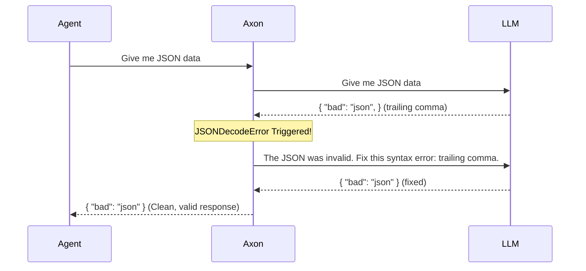
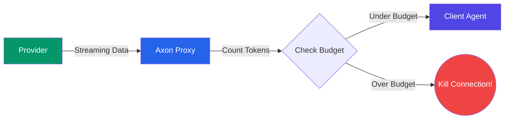
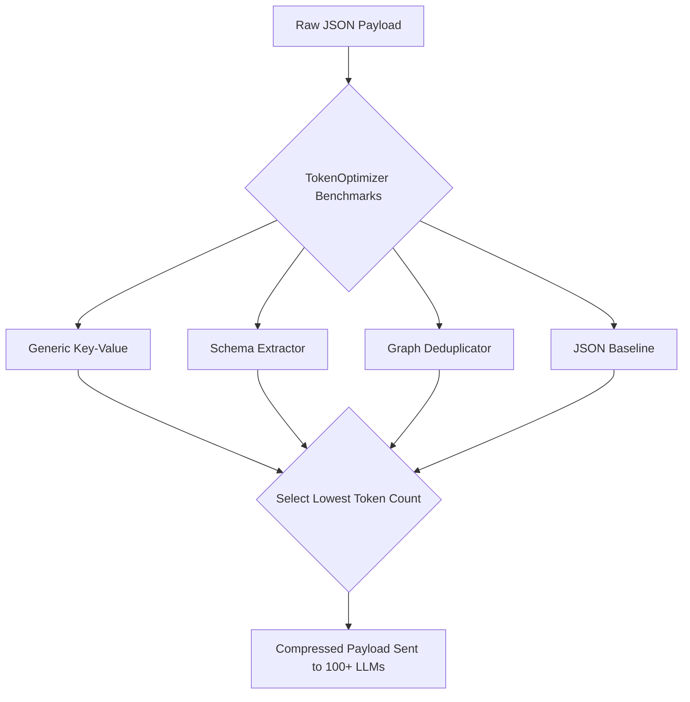

# Axon Bridge

**Token-efficient agentic middleware for LLM APIs.** Axon sits between your application and any LLM, automatically benchmarking 8 encoding strategies, healing JSON crashes, and mathematically reducing API token costs by **up to 70%** with zero changes to your existing code.

**Original Author:** [Chaitanya Sharma](https://github.com/chaitanya-sharmaa/axon)

```bash
pip install axon-bridge
axon serve
```

> **Drop-in OpenAI proxy.** Point any OpenAI SDK client at Axon instead of `api.openai.com` and get instant token savings and multi-provider support with one line changed.

---

## 🚀 Core Value: Axon vs No Axon

Axon is an intelligent firewall for your tokens. Every request goes through a rigorous gauntlet of caching, pruning, and structural compression before it ever hits the LLM.

### 1. The Universal Proxy Engine (LiteLLM Integration)

| Without Axon | With Axon |
|---|---|
| You must rewrite your SDK code to support `openai`, `anthropic`, and `google-genai`. | **One SDK rules them all.** Send OpenAI-formatted payloads to Axon, and it translates them to 100+ providers automatically. |
| You pay full price for raw, bloated JSON token payloads. | Axon dynamically compresses your payload before it hits the provider, saving up to 70%. |

### 2. Autonomous JSON Healing (Agentic Resilience)

| Without Axon | With Axon |
|---|---|
| If the LLM generates a trailing comma or missing quote, your `json.loads()` crashes and your Agent dies. | Axon intercepts the `JSONDecodeError`, appends the error to the message history, and asks the LLM to fix it *before* returning it to your Agent. |



### 3. Streaming Circuit Breaker

| Without Axon | With Axon |
|---|---|
| A rogue agent gets stuck in an infinite loop, streaming 100,000 tokens of gibberish and draining your API budget. | Pass `X-Axon-Max-Spend: 0.10` in the header. Axon counts tokens mid-stream. If the cost exceeds 10 cents, Axon cleanly terminates the TCP connection. |



### 4. Dynamic Encoding & Compression

| Without Axon | With Axon |
|---|---|
| Sending 1,000 JSON items costs 30,000 tokens due to the repeated keys on every single row. | Axon mathematically detects the schema, strips all keys, sends the schema once at the top, and sends raw comma-separated values below it. 30,000 tokens drops to 8,000 tokens. |
| Turn 1 sends 10KB. Turn 2 changes one variable and sends 10.1KB. The LLM re-reads the entire 10KB context again. | **Session Deduplication (TOON):** Axon maintains state. Turn 1 sends 10KB. Turn 2 sends ONLY the 0.1KB delta. The LLM processes 99% fewer tokens. |



### 5. Real Dollar Cost Tracking & Tenant Quotas

| Without Axon | With Axon |
|---|---|
| You find out you overspent your OpenAI budget at the end of the month when you get the invoice. | Pass `X-Axon-Tenant-ID`. Axon atomically tracks exact dollar spend per user/tenant in Redis. If they hit their budget, Axon blocks them instantly with a `429 Too Many Requests`. |

---

## 💻 Zero-Code Integration — OpenAI Proxy

The fastest way to start saving tokens. Change **one line** in your existing code. You can route to ANY of the 100+ providers just by changing the model string!

```python
import openai

client = openai.OpenAI(
    base_url="http://localhost:8080/v1",   # ← only change
    api_key="your-anthropic-key",          # ← Automatically translated!
)

# Axon translates the OpenAI schema to Anthropic seamlessly
response = client.chat.completions.create(
    model="claude-3-5-sonnet", 
    messages=[{"role": "user", "content": "Summarise the latest earnings report..."}],
    stream=True
)

# Token savings are injected into HTTP response headers!
# x-axon-metrics: {"savings_pct": 38.2, "original_tokens": 812, "compressed_tokens": 501}
# x-axon-cost-saved-usd: 0.00156
```

---

## 🐍 Native Python SDK Wrapper (`axon.patch`)

If you don't want to run a separate proxy server, you can use Axon as a native Python library! Just wrap your existing OpenAI client, and Axon will seamlessly intercept, compress, and add JSON Healing locally.

```python
import openai
from axon import patch

# 1. Create a standard AsyncOpenAI client
client = openai.AsyncOpenAI(api_key="sk-your-real-key")

# 2. Patch it with Axon
client = patch(client)

# 3. Use it exactly as before. Your agent's payloads are now automatically compressed!
response = await client.chat.completions.create(
    model="gpt-4o",
    messages=[{"role": "user", "content": "Huge payload..."}],
    response_format={"type": "json_object"}, # JSON Healing automatically activated!
    stream=True 
)

async for chunk in response:
    print(chunk.choices[0].delta.content)
```

---

## 🤖 The Agentic Feature Suite

AI Agents consume massive amounts of tokens through tool schemas, thought monologues, and raw HTML scraping. Axon provides a purpose-built feature suite to compress and protect Agentic workflows.

1. **Vision Payload Downscaling**: Automatically intercepts `base64` images. Axon uses `Pillow` to silently downscale massive 4K images to 768px/512px while preserving aspect ratio, slashing Vision API costs by up to 85%.
2. **Semantic Cache**: If you send a prompt that is >95% semantically similar to a previous request, Axon intercepts it and instantly returns the cached response. Zero API tokens used, <50ms latency.
3. **Smart LLM Routing**: Short, simple payloads sent to expensive models (like `gpt-4o`) are automatically down-routed to cheaper models (like `gpt-4o-mini`).
4. **Dynamic Tool Schema Pruning (MCP)**: Axon uses a fast, local **BM25 semantic filter** to dynamically drop irrelevant tools from the context window based on the user's immediate query, saving thousands of tokens per turn without breaking the agent.
5. **DOM to Markdown Pruner**: For Browser-automation agents, Axon intercepts raw HTML payloads, aggressively strips `<script>`, `<style>`, and hidden elements, and condenses the structure into pure Markdown.

---

## 📚 Framework Integrations

### LlamaIndex (RAG Pruning)

Use the Axon `NodePostprocessor` to dynamically compress retrieved context chunks from your vector database *before* they are sent to the LLM. Drops the bottom 25% of irrelevant nodes automatically!

```python
from integrations.llamaindex import AxonNodePostprocessor
from services.token_optimizer import TokenOptimizer

axon_postprocessor = AxonNodePostprocessor(
    optimizer=TokenOptimizer(), 
    model="gpt-4o",
    enable_pruning=True
)

query_engine = index.as_query_engine(node_postprocessors=[axon_postprocessor])
response = query_engine.query("What is the Q3 revenue?")
```

### LangChain

```python
from langchain_openai import ChatOpenAI
from integrations.langchain import AxonCallbackHandler
from services.token_optimizer import TokenOptimizer

handler = AxonCallbackHandler(optimizer=TokenOptimizer(), session_id="my-session")
llm = ChatOpenAI(model="gpt-4o", callbacks=[handler])

llm.invoke("Explain the transformer architecture...")
print(handler.last_savings)
```

---

## 🛠️ CLI & Server Ops

```bash
# Start the server locally
axon serve --port 8080 --reload

# Benchmark all 8 strategies against a JSON file to find the cheapest payload
axon benchmark my_payload.json --model gpt-4o

# One-shot compress a JSON string manually
axon encode '{"symbols": [{"qualified_name": "pkg.Auth", "kind": "class"}]}'

# Inspect / delete a session to reset stateful deduplication
axon session show my-session-id
```

---

## ⚙️ Deployment & Configuration

Axon is designed for production DevOps environments. It natively exports OpenTelemetry Prometheus metrics on the `/metrics` endpoint, allowing your SRE team to monitor exact `axon.tokens.saved` and latency overhead.

### Docker

```bash
# SQLite (single instance for local / dev)
docker compose up

# Redis (multi-instance / horizontal scale for K8s)
docker compose -f docker-compose.yml -f docker-compose.redis.yml up
```

### Environment Variables

Copy `.env.example` to `.env`. Key variables include:

| Variable | Default | Description |
|---|---|---|
| `AXON_PORT` | `8080` | Server port |
| `AXON_MEMORY_TYPE` | `sqlite` | `sqlite` or `redis` |
| `AXON_MAX_SESSIONS` | `1000` | LRU cap for in-memory session state |
| `AXON_REQUIRE_API_KEY` | `false` | Enforce `X-API-Key` on proxy requests |
| `AXON_ENABLE_TENANT_QUOTAS` | `false` | Enable strict dollar-based quotas per API key |

---

## 🤝 Contributing

See [CONTRIBUTING.md](CONTRIBUTING.md) for dev setup, test commands, and how to add a custom strategy to the plugin registry.

```bash
pip install -e ".[dev]"
pytest tests/ -v
ruff check .
```

---

## 📜 License

**MIT License**

Copyright (c) 2026 Chaitanya Sharma

This project is licensed under the MIT License - see the [LICENSE](LICENSE) file for details.
