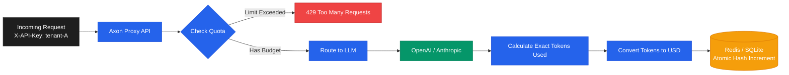

# Axon Bridge - LLM Token Saving & Cost Reduction Middleware

**Token-efficient agentic middleware for LLM APIs.** Axon sits transparently between your application and any LLM, automatically benchmarking encoding strategies, healing JSON crashes, and mathematically reducing token costs and network latency with zero changes to your existing code.

**Original Author:** [Chaitanya Sharma](https://github.com/chaitanya-sharmaa/axon) - chaitanyasharma04uk@gmail.com

```bash
pip install axon-bridge
axon serve
```

> **Drop-in OpenAI proxy.** Point any OpenAI SDK client at Axon instead of `api.openai.com` and get instant token savings, autonomous healing, and multi-provider support with one line changed.

---

## 🚀 What is Axon?

Axon Bridge is a high-performance proxy and intelligence layer for LLM applications. It uses **LiteLLM** under the hood, meaning it natively understands standard OpenAI-formatted requests and can automatically translate and route them to over 100+ different providers (OpenAI, Gemini, Anthropic, AWS, local models).

Before your request ever hits an external server, Axon intercepts it, mathematically strips away structural bloat, protects sensitive data, and dynamically ensures your agent operates within its budget.

---

## 💡 Why It Is Used & Core Benefits

**The Problem:** LLM APIs charge you by the token. When building autonomous agents or RAG systems, you often send massive amounts of JSON data, deep nested schemas, and historical conversational turns. The vast majority of these tokens are structural bloat (repeated keys, commas, brackets) that reasoning models simply do not need to understand the semantic intent.

**The Solution:** Axon's **TokenOptimizer** automatically condenses this bloat via 8 dynamic encoding strategies.

### Core Benefits:
* **Zero Semantic Loss:** Compression is purely structural. The LLM retains 100% semantic comprehension and avoids hallucinations.
* **Massive Bandwidth & Latency Savings:** Up to 99% network latency reduction on multi-turn conversations via the Stateful Threads API.
* **Direct Token Savings:** ~20-30% guaranteed API token reduction on complex JSON schemas. Up to 99% API token reduction when paired with native Provider Caching.

---

## 🛠️ Underlying Technologies

* **LiteLLM**: Standardizes inputs to the OpenAI format, enabling universal routing.
* **SQLite / Redis**: High-speed local memory layer used exclusively for the **Stateful Threads API** to rehydrate conversational context.
* **rank_bm25**: Advanced semantic search algorithm used for dynamic context pruning.
* **Pillow**: Python imaging library used to aggressively downscale massive Base64 vision payloads.

---

## 📊 Verified Benchmarking Results (Stateful Threads)

We rigorously test Axon's token compression against highly complex, real-world data payloads to guarantee zero hallucinations.

### Scenario: E-Commerce Product Catalog (Multi-Turn Thread)
*Payload: A massive JSON array of heavily nested products.*

| Turn | Action | Axon Strategy | Result |
|---|---|---|---|
| **Turn 1** | Identify cheapest item | *Schema Flattening* | ✅ **29.6% API Token Savings** |
| **Turn 2** | Follow-up question | *Network Delta* | ✅ **99.9% Network Bandwidth Saved** (Client uploads 5 tokens instead of 10,000). Proxy rehydrates and maintains ~17% API savings. |

---

## ⚙️ Features & Modes

Axon operates in different modes depending on whether your LLM API is stateless or stateful.

### 1. Stateless Execution (Safe For Standard OpenAI / Ollama)
Standard LLM operations are stateless. When operating normally, Axon applies non-destructive, single-turn mathematical transformations that are 100% safe for stateless APIs.

* **Schema Flattening**: Converts deeply nested multi-dimensional JSON objects into flat dot-notation structures (e.g. `settings.theme=dark`) before applying token compression.
* **BM25 Semantic Graph Pruning**: Uses `rank_bm25` to dynamically drop the bottom 25% of irrelevant context symbols based on the user's immediate query.
* **The Stateful Threads API (`X-Axon-Stateful-Thread: true`)**: 
  Instead of uploading your massive `messages=[...]` history on every turn, your client only sends the newest message. Axon's **SQLite database** rehydrates the full history from local memory, runs safe Schema Flattening, and forwards it to the LLM. 
  **Result:** 99% Network Bandwidth reduction. ~20% API Token reduction. 0% chance of hallucination.

### 2. Provider-Side Caching (Anthropic & Paid Gemini)
> ⚠️ **WARNING:** Never use TRON/TOON against stateless APIs (like standard OpenAI or Ollama). Because these algorithms physically delete data and replace it with `@ref` pointers, stateless models will hallucinate.

If you are using Anthropic Prompt Caching or Gemini `cachedContent` (paid plan), the provider's server caches the physical key-value states. In this specific setup, you can safely enable **destructive proxy deduplication** by setting `AXON_ENABLE_STATEFUL_COMPRESSION=true`.

* **TOON (Deltas)**: Replaces unchanged data across turns with `{"__deleted__": true}` markers.
* **TRON (References)**: Mathematically replaces long scalar strings with compact **Integer IDs** (e.g., `@ref:1`, `@ref:2`).
**Result:** Because the provider remembers the state, you achieve **99% API Token Savings** with zero hallucinations.

### 🛡️ Agentic Protections
* **JSON Healing**: Intercepts malformed JSON syntax errors, asks the LLM to fix it silently, and returns a clean response to your Agent.
* **Vision Payload Downscaling**: Strips 4K images down to 768px/512px.
* **Fast Vector Semantic Cache**: Instantly returns answers to repeated questions using SHA-256 and cosine similarity embeddings.
* **Streaming Circuit Breaker**: Counts tokens mid-stream and forcefully kills the TCP connection if an agent exceeds its USD budget.

---

## 🔧 Configuration Variables

Axon is highly configurable via `.env`.

### Execution Modes & Caching
| Variable | Default | Description |
|---|---|---|
| `AXON_ENABLED_FORMATS` | `(all)` | Comma-separated list of the 8 encoding strategies to benchmark. |
| `AXON_ENABLE_STATEFUL_COMPRESSION` | `false` | Enables TOON/TRON proxy deduplication. **DANGER: Only safe if you use Anthropic Prompt Caching or Gemini Context Caching. Do not use on stateless models!** |
| `AXON_ENABLE_GEMINI_PROMPT_CACHE` | `false` | Injects `cache_control` hints for Gemini's API. **Requires paid Gemini plan.** |
| `AXON_TOKENIZER_MODEL` | `cl100k_base` | The default tokenizer to use for mathematical token estimation. |

### Memory & Persistence
| Variable | Default | Description |
|---|---|---|
| `AXON_MEMORY_TYPE` | `sqlite` | The database type used to store thread histories (`sqlite` or `redis`). |
| `AXON_MEMORY_DB_PATH` | `./axon_sessions.db` | Local file path for the SQLite database. |

### Security, Routing, & Quotas
| Variable | Default | Description |
|---|---|---|
| `AXON_REQUIRE_API_KEY` | `false` | Enforce `X-API-Key` on proxy requests. |
| `AXON_ENABLE_TENANT_QUOTAS` | `false` | Track and block atomic USD spend per tenant (`X-Axon-Tenant-ID`). |



---

## 📜 License
**MIT License** - Copyright (c) 2026 Chaitanya Sharma
