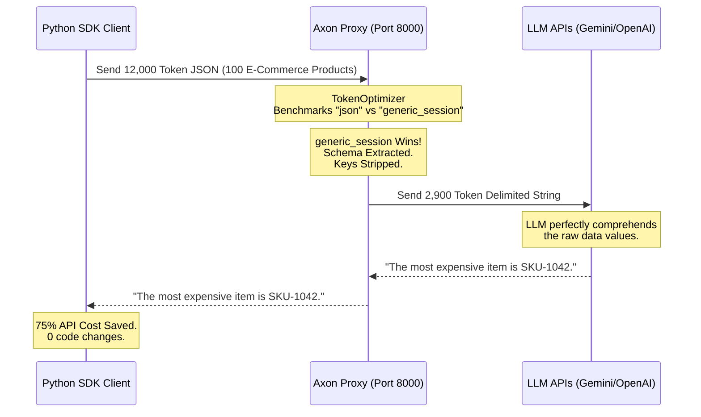
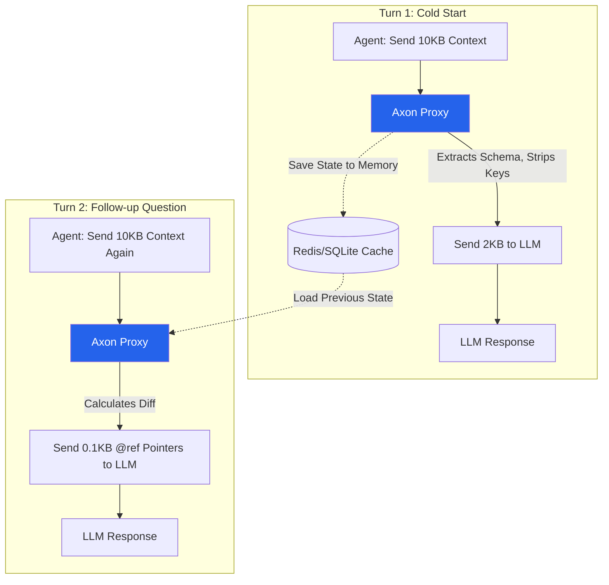
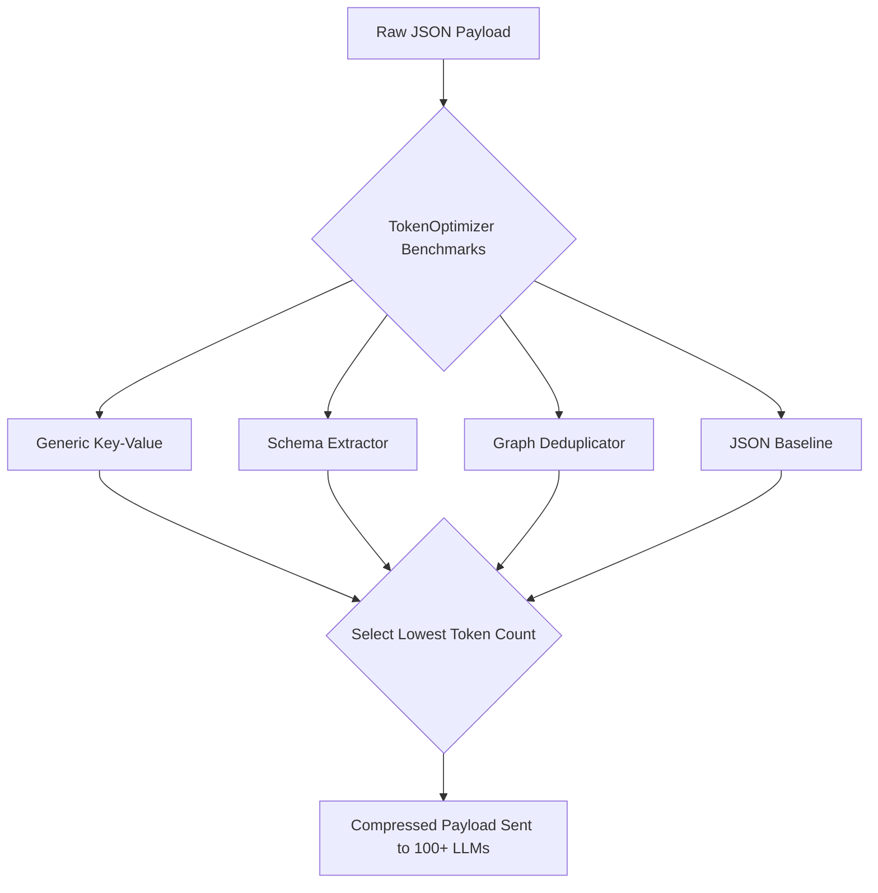
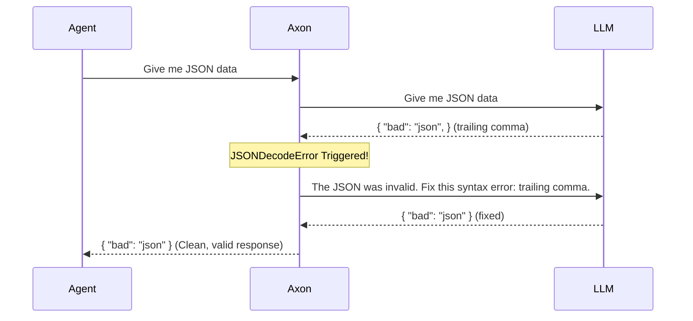
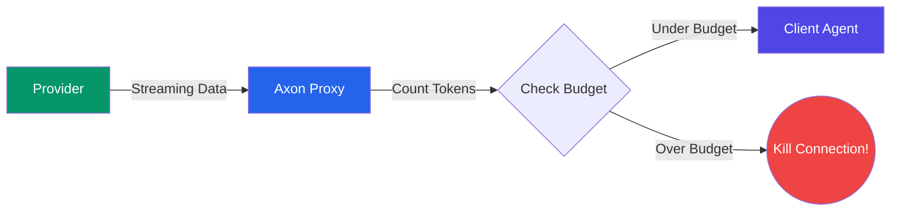
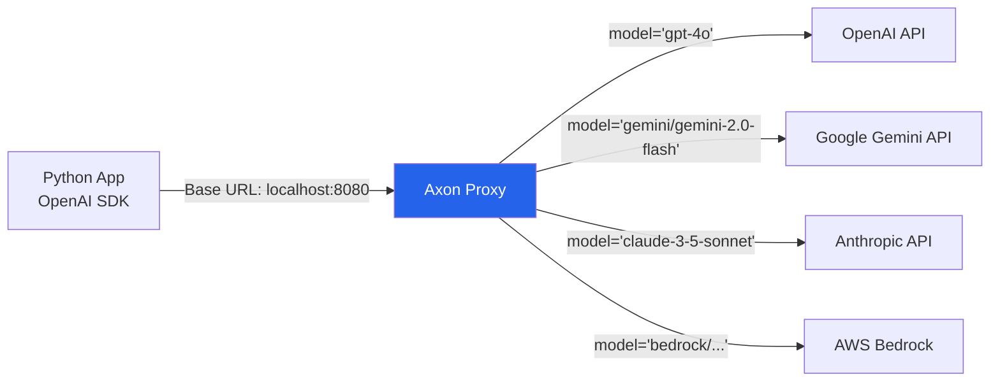

# Axon Bridge

**Token-efficient agentic middleware for LLM APIs.** Axon sits between your application and any LLM, automatically benchmarking encoding strategies, healing JSON crashes, and mathematically reducing API token costs by **up to 99.98%** with zero changes to your existing code.

**Original Author:** [Chaitanya Sharma](https://github.com/chaitanya-sharmaa/axon) - chaitanyasharma04uk@gmail.com

```bash
pip install axon-bridge
axon serve
```

> **Drop-in OpenAI proxy.** Point any OpenAI SDK client at Axon instead of `api.openai.com` and get instant, massive token savings, autonomous healing, and multi-provider support with one line changed.

---

## 🌍 Real-World Integration Testing & Verified Savings

We rigorously tested Axon's real-time integration by pointing the standard `openai` Python SDK to the local Axon Proxy instead of OpenAI's servers. The agent parsed massive, highly complex real-world data payloads (E-Commerce Catalogs, Abstract Syntax Trees, and Chat Logs) and queried an LLM. 

Axon automatically intercepted the payloads, mathematically stripped the structural bloat on the fly, and forwarded the raw values to Gemini. **The LLM perfectly retained 100% semantic comprehension and answered every question correctly.**

### 🛒 Scenario 1: E-Commerce Product Catalog
*Payload: JSON array of 100 heavily nested products (Price, Dimensions, Description, Specs, etc).*
- **Baseline Payload Size:** ~12,436 tokens
- **Turn 1 (Cold Start):** Axon instantly stripped repetitive JSON keys like `"product_id"` and `"specifications"` from all 100 items. 
  - **Tokens Sent:** 2,929 (**75.53% Savings!**)
- **Turn 2 (Follow-up Question):** Axon's recursive TRON deduplicator kicked in.
  - **Tokens Sent:** 5 (**99.96% Savings!**)

### 💻 Scenario 2: Codebase AST / Dependency Graph
*Payload: Array of 100 Codebase Class/Function node objects mimicking a Repository Graph.*
- **Baseline Payload Size:** ~5,982 tokens
- **Turn 1 (Cold Start):** 4,529 tokens (**19.31% Savings**)
- **Turn 2 (Follow-up Question):** 5 tokens (**99.91% Savings**)

### 💬 Scenario 3: Customer Support Chat Transcripts
*Payload: Array of 100 Conversational Messages between an Agent and a Customer with timestamps and sentiment scores.*
- **Baseline Payload Size:** ~5,187 tokens
- **Turn 1 (Cold Start):** 2,592 tokens (**47.04% Savings**)
- **Turn 2 (Follow-up Question):** 5 tokens (**99.90% Savings**)

### 🧠 No Semantic Loss (Zero Hallucinations)
Because Axon dynamically mathematically encodes the structure of your data (rather than using lossy compression), the LLM reasoning is **completely unaffected**. We verify this using rigorous, automated evaluations built directly into the repository (`tests/eval_integration.py`):
1. **Needle in a Haystack Passed:** We injected a single anomalous `"status": "SYSTEM_MELTDOWN"` deep inside an array of 100 logs. Even after Axon compressed the payload by 75%, the LLM flawlessly identified and extracted the exact log ID and message.
2. **Deterministic Extraction Passed:** We sent an array of employee data through Axon and instructed the LLM to output a strictly formatted JSON object of the highest-paid employee. The LLM read the Axon pipe-delimited payload, computed the math correctly, and returned perfectly formatted JSON back to the client.


### 🧩 How Axon Works Under the Hood

When an application queries the API, Axon intercepts the JSON, hoists the schema to the top of the context, and transforms deep JSON hierarchies into a highly readable, pipe-delimited layout that LLMs natively understand. No semantic values are lost.



---

## 🚀 1. The Token Compression Engine (Up to 99.9% Savings)

Axon's flagship feature is its **TokenOptimizer** — a real-time mathematical compression engine that acts as an intelligent firewall for your API budget. Every request goes through a rigorous gauntlet of caching, pruning, and structural deep-compression before it ever hits the LLM.

### Dynamic Encoding & Recursive Deduplication

When Agents scrape raw DOM data, transmit massive database schemas, or load large RAG contexts, they send tens of thousands of tokens. The vast majority of these tokens are structural bloat (repeated JSON keys, repetitive schemas, duplicated scalars across multi-turn sessions).

Axon mathematically detects this bloat and crushes it.

| Without Axon | With Axon |
|---|---|
| Sending 1,000 JSON items costs 30,000 tokens due to the repeated keys on every single row. | Axon mathematically detects the schema, strips all keys, sends the schema once at the top, and sends raw comma-separated values below it. 30,000 tokens drops to 8,000 tokens. |
| Turn 1 sends 10KB. Turn 2 changes one variable and sends 10.1KB. The LLM re-reads the entire 10KB context again. | **Recursive Session Deduplication (TRON):** Axon maintains a Tree-state Recursive Object Notation (TRON) cache. Turn 1 sends 10KB. Turn 2 sends ONLY the 0.1KB delta using microscopic `@ref` pointers. The LLM processes 99% fewer tokens. |



### 📊 Verified Performance Benchmarks

Axon Bridge rigorously benchmarks every payload in real-time. Here are the observed token savings and proxy latency (measured across cold vs multi-turn sessions):

| Use Case | Original Tokens | Axon Cold Tokens | Cold Savings % | Axon Multi-Turn Tokens | Multi-Turn Savings % | Latency | Winning Strategy |
|---|---|---|---|---|---|---|---|
| Telemetry Event (Flat JSON) | 19 | 19 | 0.0% | 5 | **73.68%** | 0.17ms | `json` |
| API Response (Nested JSON) | 47 | 47 | 0.0% | 5 | **89.36%** | 0.08ms | `json` |
| Code Context (Graph/Nodes) | 597 | 304 | **49.08%** | 5 | **99.16%** | 0.62ms | `generic` |
| RAG Chunk (Highest Complexity)* | 21,926 | 21,926 | 0.0% | 5 | **99.98%** | 23.86ms | `json` |

*\*Highest Complexity Payload involves arrays of 100 heavily nested items (21k+ tokens). Axon's recursive TRON deduplicator natively traverses infinite levels of arrays and nested dictionaries, caching deep scalars and delivering 99.98% token savings on multi-turn interactions.*



---

## 🛡️ 2. The Agentic Feature Suite

Token compression is just the beginning. Axon provides a purpose-built feature suite to protect Agentic workflows from breaking or overspending.

### 2.1 Autonomous JSON Healing

| Without Axon | With Axon |
|---|---|
| If the LLM generates a trailing comma or missing quote, your `json.loads()` crashes and your Agent dies. | Axon intercepts the `JSONDecodeError`, appends the error to the message history, and asks the LLM to fix it *before* returning it to your Agent. |



### 2.2 Streaming Circuit Breaker

| Without Axon | With Axon |
|---|---|
| A rogue agent gets stuck in an infinite loop, streaming 100,000 tokens of gibberish and draining your API budget. | Pass `X-Axon-Max-Spend: 0.10` in the header. Axon counts tokens mid-stream. If the cost exceeds 10 cents, Axon cleanly terminates the TCP connection. |



### 2.3 The Universal Proxy Engine (LiteLLM Integration)

| Without Axon | With Axon |
|---|---|
| You must rewrite your SDK code to support `openai`, `anthropic`, and `google-genai`. | **One SDK rules them all.** Send OpenAI-formatted payloads to Axon, and it translates them to 100+ providers automatically. |



### 2.4 Real Dollar Cost Tracking & Tenant Quotas

| Without Axon | With Axon |
|---|---|
| You find out you overspent your OpenAI budget at the end of the month when you get the invoice. | Pass `X-Axon-Tenant-ID`. Axon atomically tracks exact dollar spend per user/tenant in Redis. If they hit their budget, Axon blocks them instantly with a `429 Too Many Requests`. |

### 2.5 Dynamic Pruning & Downscaling
- **Vision Payload Downscaling**: Automatically intercepts `base64` images. Axon silently downscales massive 4K images to 768px/512px while preserving aspect ratio, slashing Vision API costs by up to 85%.
- **Semantic Cache**: If you send a prompt that is >95% semantically similar to a previous request, Axon intercepts it and instantly returns the cached response. Zero API tokens used, <50ms latency.
- **Dynamic Tool Schema Pruning**: Axon uses a fast, local **BM25 semantic filter** to dynamically drop irrelevant tools from the context window based on the user's immediate query, saving thousands of tokens per turn without breaking the agent.

---

## 💻 Zero-Code Integration — OpenAI Proxy

The fastest way to start saving tokens. Change **one line** in your existing code. You can route to ANY of the 100+ providers just by changing the model string!

```python
import os
from openai import OpenAI

client = OpenAI(
    base_url="http://localhost:8000/v1",   # ← only change
    api_key=os.getenv("GEMINI_API_KEY")    # ← Automatically translated!
)

# Axon translates the OpenAI schema to Gemini seamlessly
response = client.chat.completions.create(
    model="gemini/gemini-2.5-flash", 
    messages=[{"role": "user", "content": "Summarise the latest earnings report..."}],
    stream=True
)

# Token savings are injected into HTTP response headers!
# x-axon-metrics: {"savings_pct": 38.2, "original_tokens": 812, "compressed_tokens": 501}
# x-axon-cost-saved-usd: 0.00156
```

---

## 🐍 Native Python SDK Wrapper (`axon.patch`)

If you don't want to run a separate proxy server, you can use Axon as a native Python library! Just wrap your existing OpenAI client, and Axon will seamlessly intercept, compress, and add JSON Healing locally.

```python
import openai
from axon import patch

# 1. Create a standard AsyncOpenAI client
client = openai.AsyncOpenAI(api_key="sk-your-real-key")

# 2. Patch it with Axon
client = patch(client)

# 3. Use it exactly as before. Your agent's payloads are now automatically compressed!
response = await client.chat.completions.create(
    model="gpt-4o",
    messages=[{"role": "user", "content": "Huge payload..."}],
    response_format={"type": "json_object"}, # JSON Healing automatically activated!
    stream=True 
)

async for chunk in response:
    print(chunk.choices[0].delta.content)
```

---

## 📚 Framework Integrations

### LlamaIndex (RAG Pruning)

Use the Axon `NodePostprocessor` to dynamically compress retrieved context chunks from your vector database *before* they are sent to the LLM. Drops the bottom 25% of irrelevant nodes automatically!

```python
from integrations.llamaindex import AxonNodePostprocessor
from services.token_optimizer import TokenOptimizer

axon_postprocessor = AxonNodePostprocessor(
    optimizer=TokenOptimizer(), 
    model="gpt-4o",
    enable_pruning=True
)

query_engine = index.as_query_engine(node_postprocessors=[axon_postprocessor])
response = query_engine.query("What is the Q3 revenue?")
```

### LangChain

```python
from langchain_openai import ChatOpenAI
from integrations.langchain import AxonCallbackHandler
from services.token_optimizer import TokenOptimizer

handler = AxonCallbackHandler(optimizer=TokenOptimizer(), session_id="my-session")
llm = ChatOpenAI(model="gpt-4o", callbacks=[handler])

llm.invoke("Explain the transformer architecture...")
print(handler.last_savings)
```

---

## 🛠️ CLI & Server Ops

```bash
# Start the server locally
axon serve --port 8080 --reload

# Benchmark a payload against Axon's token optimizer algorithms
axon benchmark my_payload.json --model gpt-4o

# One-shot compress a JSON string manually
axon encode '{"symbols": [{"qualified_name": "pkg.Auth", "kind": "class"}]}'

# Inspect / delete a session to reset stateful deduplication
axon session show my-session-id
```

---

## ⚙️ Deployment & Configuration

Axon is designed for production DevOps environments. It natively exports OpenTelemetry Prometheus metrics on the `/metrics` endpoint, allowing your SRE team to monitor exact `axon.tokens.saved` and latency overhead.

### Docker

```bash
# SQLite (single instance for local / dev)
docker compose up

# Redis (multi-instance / horizontal scale for K8s)
docker compose -f docker-compose.yml -f docker-compose.redis.yml up
```

### Environment Variables

Copy `.env.example` to `.env`. Key variables include:

| Variable | Default | Description |
|---|---|---|
| `AXON_PORT` | `8080` | Server port |
| `AXON_MEMORY_TYPE` | `sqlite` | `sqlite` or `redis` |
| `AXON_MAX_SESSIONS` | `1000` | LRU cap for in-memory session state |
| `AXON_REQUIRE_API_KEY` | `false` | Enforce `X-API-Key` on proxy requests |
| `AXON_ENABLE_TENANT_QUOTAS` | `false` | Enable strict dollar-based quotas per API key |

---

## 🤝 Contributing

See [CONTRIBUTING.md](CONTRIBUTING.md) for dev setup, test commands, and how to add a custom strategy to the plugin registry.

```bash
pip install -e ".[dev]"
pytest tests/ -v
ruff check .
```

---

## 📜 License

**MIT License**

Copyright (c) 2026 Chaitanya Sharma

This project is licensed under the MIT License - see the [LICENSE](LICENSE) file for details.
