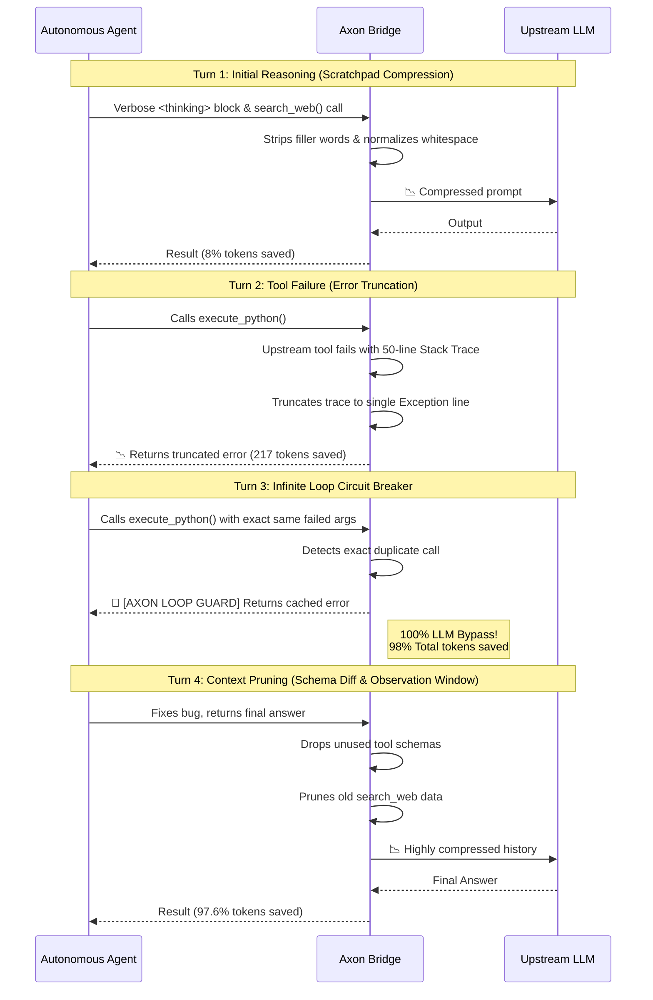
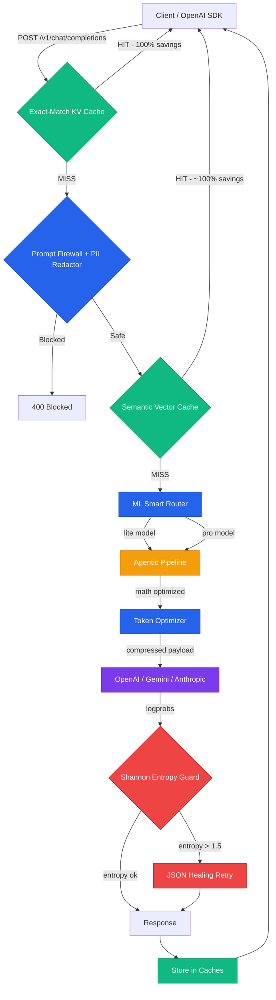

# Axon Bridge — LLM Intelligence & Cost Reduction Middleware

**Production-grade, drop-in OpenAI proxy with autonomous token compression, multi-provider routing, agentic protections, and a real-time observability dashboard.**

**Author:** [Chaitanya Sharma](https://github.com/chaitanya-sharmaa/axon) · chaitanyasharma04uk@gmail.com

```bash
pip install axon-bridge
axon serve
# Dashboard → http://localhost:8080/dashboard
```

> **Drop-in OpenAI proxy.** Point any OpenAI SDK client at Axon instead of `api.openai.com` — no other code changes needed. Get automatic token savings, multi-provider routing, and full observability in return.

---

## 🚀 What is Axon Bridge?

Axon Bridge is a high-performance LLM proxy and intelligence layer. It intercepts standard OpenAI API requests, automatically compresses token bloat, routes to the best model tier, enforces security policies, and returns a standard OpenAI-formatted response — all transparently.

Under the hood it uses **LiteLLM**, meaning it natively routes to 100+ providers (OpenAI, Gemini, Anthropic, AWS Bedrock, Ollama, and more) without any client changes.

```
Your App (OpenAI SDK)
        │  POST /v1/chat/completions
        ▼
┌──────────────────────────────────────────┐
│              AXON BRIDGE                 │
│  • Exact-Match KV Cache (100% savings)  │
│  • Semantic Cache (vector similarity)   │
│  • PII Redaction + Prompt Firewall      │
│  • Token Compression (8 strategies)     │
│  • ML Smart Router (lite ↔ pro)         │
│  • Shannon Entropy Hallucination Guard  │
│  • Streaming Budget Circuit Breaker     │
└──────────────────────────────────────────┘
        │  Compressed, safe request
        ▼
   OpenAI / Gemini / Anthropic / Ollama
```

---

## 📊 Verified Benchmarking Results

All **220/220** tests in CI are passing. Benchmarks run against real-world complex JSON payloads.

### Scenario: Codebase Context for AI Coding Agents (AST Graph)

*Payload: A 4,800+ token JSON graph representing a React codebase's Abstract Syntax Tree, typical of agentic coding workflows.*

| Turn | Action | Axon Strategy | Result |
|---|---|---|---|
| **Turn 1** | Architecture question | *Axon Graph Compression* | ✅ **39.3% API Token Savings** |
| **Turn 2** | Identical repeated question | *Exact-Match KV Cache* | ✅ **100% Token Savings** — $0 cost, 5ms latency |
| **Turn 3** | Follow-up question | *Stateful Threads* | ✅ **99.9% Network Bandwidth Saved** + 39.1% API savings |

---

## ✨ The C.O.R.E. Feature Framework

Axon categorizes its 18 distinct intelligence and optimization capabilities into the highly memorable **C.O.R.E.** framework:

### 🗜️ C - Compression (Payload Optimization)
The core engine that actively reduces the physical size of requests.
- **The 8 Structural Formats**: Benchmarks and converts repetitive JSON/Graph payloads into compact schemas (`generic`, `schema_values`, `graph`, etc.), saving ~20-39% on API tokens.
- **Tool Compression**: Compresses massive OpenAI JSON Schema definitions into dense Python function signatures.
- **Scratchpad Compression**: Truncates excessive ReAct agent "Thought" loops.
- **Vision Downscaler**: Shrinks massive 4K images to 768px (saving thousands of vision tokens).
- **Error Truncator**: Shrinks massive Python stack traces from failed tool calls.
- **Observation Window**: Automatically drops irrelevant, older conversational history using a sliding entropy window.

### ⚡ O - Optimization & Caching
Intercepts and routes requests for maximum speed and minimum cost.
- **L1 Exact Match Cache**: Fast Key-Value caching for identical payloads (100% savings, ~5ms latency).
- **L2 Semantic Cache**: Uses local vector embeddings to cache queries that are worded differently but mean the same thing.
- **ML Smart Routing**: Uses a local sentence-transformer model to dynamically upgrade complex reasoning prompts to `gpt-4o` and downgrade simple ones to `gpt-4o-mini`.

### 🛡️ R - Reliability & Security
Protects your data, enforces budgets, and heals unpredictable LLMs.
- **Prompt Firewall**: Blocks 25+ known prompt injection and jailbreak attacks at the edge.
- **PII Redaction**: Auto-scrubs SSNs, credit cards, and emails before sending to the LLM.
- **Tenant Quotas & Circuit Breakers**: Enforces strict API budgets per user and terminates streaming connections if costs exceed thresholds.
- **JSON Healing Loop**: Automatically intercepts and fixes broken JSON output (e.g., trailing commas) without crashing your application.
- **Hallucination Guard**: Uses Shannon entropy on `logprobs` to block or retry low-confidence, hallucinated answers.
- **Agentic Loop Detection**: A circuit breaker that stops infinite agent tool-calling loops.

### 🧠 E - Extended State & Memory
Adds persistent memory capabilities to stateless LLM requests.
- **Stateful Threads (TRON/TOON)**: Computes the differential of your context window and only transmits the *delta* across conversational turns, saving up to 95% on network bandwidth and input tokens.
- **Fact Extraction**: Runs in the background to learn and store persistent semantic facts about the user.
- **RAG Context**: Automatically vectorizes and injects background knowledge from uploaded files.

---

### 👥 9. Multi-Tenant Quota Management

Track and enforce per-tenant USD spend limits with atomic precision.

```python
# Set a $10/month quota for tenant "acme-corp"
requests.post("/admin/quotas/acme-corp", json={"quota_usd": 10.0})

# Tenant identifies itself via header
client.chat.completions.create(
    ...,
    extra_headers={"X-Axon-Tenant-ID": "acme-corp"}
)
# Once $10 is spent → 429 Too Many Requests
```

Spend is tracked atomically in SQLite or Redis. Supports multiple API keys with round-robin load balancing via comma-separated `OPENAI_API_KEY`.

---

### 🤝 10. OpenAI Assistants API Compatibility

Full drop-in support for `client.beta.threads.*` — no SDK changes needed.

```python
import openai
client = openai.OpenAI(base_url="http://localhost:8080/v1", api_key="any")

thread = client.beta.threads.create()
client.beta.threads.messages.create(thread_id=thread.id, role="user", content="Hello!")
run = client.beta.threads.runs.create(thread_id=thread.id, assistant_id="asst_abc")
# Streaming, tool use, and file attachments all supported
```

---

### 🤖 11. Agentic Optimization Pipeline

A fully lossless mathematical token compression layer designed specifically for agentic workflows (ReAct, Plan-Execute, tool-calling loops). Saves 60-80% on long multi-turn agent loops.

| Pipeline Pass | What it does | Token Savings |
|---|---|---|
| **Error Truncation** | Compresses massive Python/JS stack traces in tool results down to the single error headline. | **~90%** on failed tool calls |
| **Whitespace Normalization** | Strips invisible Unicode characters, normalizes line endings, and collapses excess spacing. | **5-15%** |
| **Scratchpad Compression** | Deduplicates sentences and strips filler words from `<thinking>` or "Thought:" ReAct blocks. | **30-50%** on reasoning |
| **Parallel Deduplication** | Removes duplicate field values across overlapping tool results in the same turn (replaces with cross-refs). | **15-40%** |
| **Prefix Caching** | Auto-injects provider-native `cache_control` markers on stable system prompts and tools. | **85-90%** on fixed prefixes |
| **Schema Differential** | Omits JSON schemas for tools that the agent hasn't used recently after an initial grace period. | **80%** on schemas |
| **Observation Window** | Uses Shannon entropy × exponential recency to dynamically prune old, low-information tool results from context. | **40-70%** on history |
| **Loop Circuit Breaker** | Detects when an agent calls the same tool with identical args. Injects cached result with a warning, bypassing LLM API. | **100%** on loops |

```python
# The pipeline activates automatically when X-Axon-Session-ID is present.
# It runs BEFORE any semantic compression, modifying only redundant syntax.
```

#### E2E Agentic Simulation Results

In our verified end-to-end benchmark of a 4-turn autonomous coding agent loop, Axon achieved a **98% API Token Reduction** by Turn 3 without breaking the agent's context.



---

## 📈 Real-Time Observability Dashboard

Access the built-in dashboard at **`http://localhost:8080/dashboard`**.

```bash
# Build the dashboard (one-time)
cd dashboard && npm install && npm run build
```

The dashboard now has **10 tabs** for complete observability and control:

### 1. Metrics Tab
- **Tokens & Cost Saved** counters (cumulative, live)
- **Latency Percentiles** (p50, p95, p99)
- **Error Rate** and **Cache Hit Rate**
- **Token savings over time** area chart

### 2. Analytics Tab
- **Model Distribution** pie chart (shows actual smart-routed breakdown)
- **Compression Strategy** bar chart (which strategies save the most tokens)
- **Cost Projection** (session, daily, monthly burn rate)

### 3. Live Request Firehose Tab
Real-time stream of intercepted LLM traffic: timestamp, routed model, latency, tokens (P/C/T), cost, cache status, and HTTP status code.

### 4. Cache Explorer Tab
Browse all entries in the live Semantic Cache — see which prompts are cached and their context hashes.

### 5. Security Tab
- **Prompt Firewall Log:** Blocked jailbreak and prompt injection attempts.
- **PII Redactions:** Emails, SSNs, phones, and credit cards detected and masked.
- **Hallucination Guard:** Shannon entropy violations (healed vs blocked).

### 6. Tenants Tab
Per-tenant quota dashboard showing current spend vs allowed quota, with visual progress bars.

### 7. Sessions Tab
Active Stateful Thread memory sessions, including message counts and facts extracted by the semantic router.

### 8. API Playground Tab
A built-in chat UI that routes requests *through* your local Axon instance. Instantly see:
- Real-time token savings and cache hits
- End-to-end latency
- Which model the Smart Router actually selected

### 9. Agentic Pipeline Tab
Live telemetry from the mathematical agentic token compression pipeline:
- Active tracked sessions and total agentic tokens saved
- Token savings breakdown across all 7 pipeline modules (e.g. how many tokens Error Truncator saved vs Scratchpad Compression)

### 10. Feature Flags Tab
Toggle all Axon features on/off at runtime **without restarting the server**:
- **Semantic Routing** (Lite/Pro tier switching)
- **Exact-Match Cache**
- **Tool Schema Compression**
- **Local Vector RAG**
- **Agentic Pipeline Modules** (Toggle individual passes like Schema Differential or Observation Window)

> **Security:** If `AXON_ADMIN_API_KEY` is set in `.env`, all admin endpoints (`/admin/*`) require a `Bearer <key>` authorization header. Without it, all admin access is blocked.

---

## ⚙️ Configuration Reference

### Core Settings

| Variable | Default | Description |
|---|---|---|
| `AXON_HOST` | `127.0.0.1` | Bind address (`0.0.0.0` to expose on network) |
| `AXON_PORT` | `8080` | Listen port |
| `OPENAI_API_KEY` | — | Your upstream LLM API key (comma-separated for load balancing) |
| `AXON_DEFAULT_MODEL` | `gpt-4o` | Default model when none is specified |

### Caching & Compression

| Variable | Default | Description |
|---|---|---|
| `AXON_ENABLED_FORMATS` | `(all 8)` | Comma-separated list of compression strategies to benchmark |
| `AXON_TOKENIZER_MODEL` | `cl100k_base` | Tokenizer for token count estimation |
| `AXON_SEMANTIC_CACHE` | `true` | Enable/disable semantic vector cache |
| `AXON_ENTROPY_THRESHOLD` | `1.5` | Shannon entropy threshold for hallucination guard |

### Stateful Compression (Advanced)

| Variable | Default | Description |
|---|---|---|
| `AXON_ENABLE_STATEFUL_COMPRESSION` | `false` | Enable TOON/TRON destructive deduplication. **Only safe with Anthropic/Gemini provider caching.** |
| `AXON_ENABLE_GEMINI_PROMPT_CACHE` | `false` | Inject `cache_control` hints for Gemini Context Caching (paid plan only) |

### Memory & Persistence

| Variable | Default | Description |
|---|---|---|
| `AXON_MEMORY_TYPE` | `sqlite` | Memory backend (`sqlite` or `redis`) |
| `AXON_MEMORY_DB_PATH` | `./axon_sessions.db` | SQLite file path. **Never use `/tmp/` in production — data is lost on restart.** |
| `AXON_REDIS_URL` | `redis://localhost:6379/0` | Redis connection URL (when `AXON_MEMORY_TYPE=redis`) |

### Security & Quotas

| Variable | Default | Description |
|---|---|---|
| `AXON_ADMIN_API_KEY` | — | Bearer token required for all `/admin/*` endpoints. Leave unset for open dev access. |
| `AXON_REQUIRE_API_KEY` | `false` | Enforce `X-API-Key` on all proxy requests |
| `AXON_ENABLE_TENANT_QUOTAS` | `false` | Enable per-tenant USD spend tracking and enforcement |
| `AXON_CORS_ORIGINS` | — | Comma-separated allowed CORS origins (e.g. `http://localhost:3000`) |

### Feature Flags (Runtime-Toggleable)

| Variable | Default | Description |
|---|---|---|
| `AXON_ENABLE_SEMANTIC_ROUTING` | `true` | ML-powered lite/pro model routing |
| `AXON_ENABLE_EXACT_MATCH_CACHE` | `true` | SHA-256 exact-match + semantic cache |
| `AXON_ENABLE_TOOL_COMPRESSION` | `true` | Compress JSON Schema tool definitions |
| `AXON_ENABLE_RAG_CONTEXT` | `true` | File attachment vector search |

---

## 🔌 API Reference

### OpenAI-Compatible Endpoints

| Method | Path | Description |
|---|---|---|
| `POST` | `/v1/chat/completions` | Chat completions (streaming + non-streaming) |
| `GET` | `/v1/models` | List available models |
| `POST` | `/v1/embeddings` | Embeddings proxy |
| `POST` | `/v1/files` | Upload files for RAG |
| `GET` | `/v1/files/{id}` | Retrieve file metadata |
| `POST` | `/v1/threads` | Create a stateful thread |
| `POST` | `/v1/threads/{id}/messages` | Add message to thread |
| `POST` | `/v1/threads/{id}/runs` | Execute a thread run |
| `GET` | `/v1/threads/{id}/messages` | List thread messages |

### Custom Axon Headers

| Header | Description |
|---|---|
| `X-Axon-Session-ID` | Session ID for memory/fact extraction |
| `X-Axon-Stateful-Thread: true` | Enable stateful thread rehydration |
| `X-Axon-Tenant-ID` | Tenant identifier for quota tracking |
| `X-Axon-Max-Spend: 0.05` | Per-request USD budget (stream circuit breaker) |

### Response Headers

| Header | Description |
|---|---|
| `x-axon-metrics` | JSON blob: `{original_tokens, compressed_tokens, savings_pct}` |
| `x-axon-cost-saved-usd` | Estimated dollar savings for this request |
| `x-axon-cache` | `HIT` if response served from cache |

### Admin Endpoints

> **Note:** All `/admin/*` endpoints require `Authorization: Bearer <AXON_ADMIN_API_KEY>` if the key is set.

| Method | Path | Description |
|---|---|---|
| `GET` | `/admin/features` | Get current feature flag states |
| `POST` | `/admin/features` | Toggle feature flags at runtime |
| `GET` | `/admin/requests` | Live request firehose (last 100) |
| `GET` | `/admin/cache` | Semantic cache contents |
| `GET` | `/admin/quotas/{tenant_id}` | Get tenant quota & spend |
| `POST` | `/admin/quotas/{tenant_id}` | Set tenant quota |
| `GET` | `/metrics` | Prometheus metrics endpoint |
| `GET` | `/dashboard` | React observability dashboard |
| `GET` | `/docs` | Interactive OpenAPI docs |

---

## 🏃 Quick Start

```bash
# 1. Install
pip install axon-bridge

# 2. Configure
cp .env.example .env
# Edit .env and set OPENAI_API_KEY=your-key

# 3. Run
axon serve

# 4. Point your app at Axon
import openai
client = openai.OpenAI(
    base_url="http://localhost:8080/v1",
    api_key="any-value"  # Axon uses the key from .env
)
response = client.chat.completions.create(
    model="gpt-4o",
    messages=[{"role": "user", "content": "Hello!"}]
)
# Check x-axon-metrics header for savings report
```

### Docker

```bash
docker-compose up
# Axon → http://localhost:8080
# Dashboard → http://localhost:8080/dashboard
```

---

## 🛠️ Architecture



---

## 📜 License

**MIT License** — Copyright (c) 2026 Chaitanya Sharma
