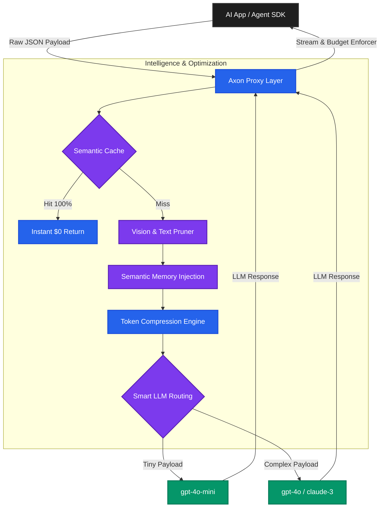
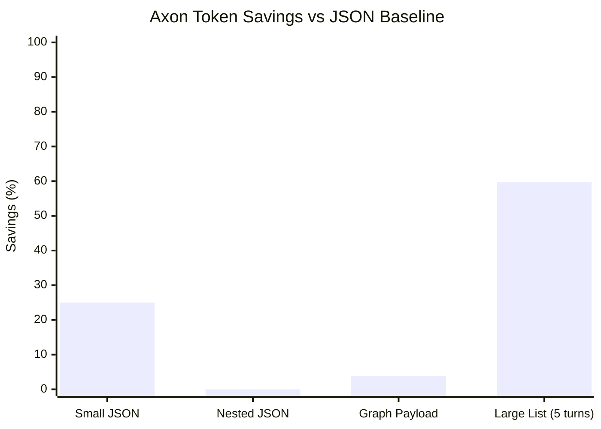
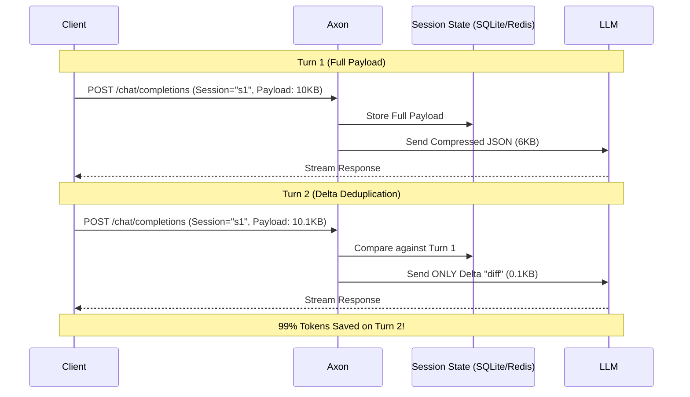
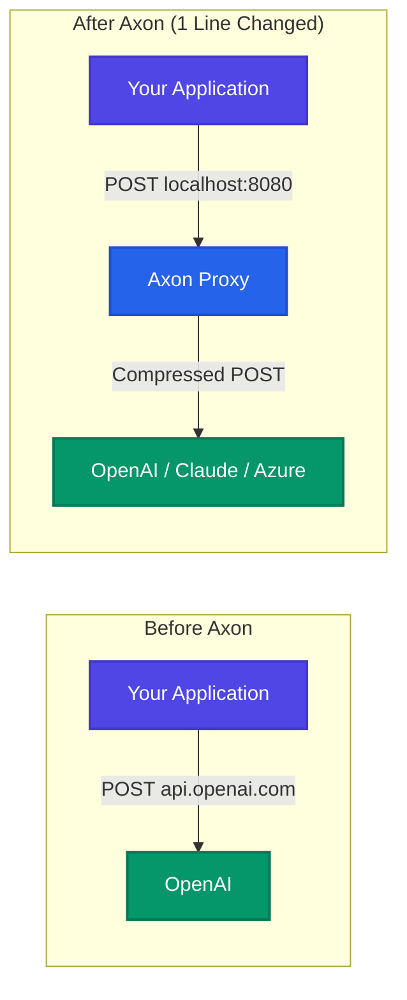

# Axon Bridge

**Token-efficient middleware for LLM APIs.** Axon sits between your application and any LLM, automatically benchmarks 8 encoding strategies, and sends the cheapest one — saving **up to 70% on API tokens** with zero changes to your existing code.

**Original Author:** [Chaitanya Sharma](https://github.com/chaitanya-sharmaa/axon)

```
pip install axon-bridge
axon serve
```

> **Drop-in OpenAI proxy.** Point any OpenAI SDK client at Axon instead of `api.openai.com` and get instant token savings with one line changed.

---

## How It Was Made (Technology Stack)

Axon is built from the ground up for high-concurrency, low-latency, and exact precision. The core proxy is written in modern asynchronous Python, utilizing the following technologies:

* **FastAPI & Uvicorn**: Powers the high-throughput asynchronous `/v1` proxy layer, ensuring the middleware adds less than 50ms of latency per request.
* **HTTPX (Async)**: Handles the streaming Server-Sent Events (SSE) connections to OpenAI/Anthropic, allowing real-time proxying without buffering.
* **Tiktoken (Rust)**: Used natively to count exact token lengths in real-time during stream generation, completely avoiding inaccurate heuristics.
* **aiosqlite & Redis**: Provides unified `X-Session-ID` state management. SQLite provides zero-setup local persistence (WAL mode), while Redis allows horizontal scaling across multiple nodes.
* **Pillow**: Silently intercepts and downscales massive `base64` vision payloads before they reach the LLM, slashing vision costs.
* **Strategy Plugin System**: The core `TokenOptimizer` dynamically benchmarks 8 different custom encoding algorithms (Generic, TOON, TRON, Graph) in parallel to find the mathematical cheapest payload.

## Core Benefits

| Problem | Axon's Solution |
|---|---|
| **LLM API bills are out of control** | Auto-picks the cheapest structural encoding per call — reducing raw token counts by up to 70%. |
| **Streaming token budget blowouts** | The Streaming Circuit Breaker exactly counts tokens mid-stream and forcefully terminates the TCP connection if the budget is hit. |
| **Sessions re-send the same data** | Multi-turn deduplication (TOON/TRON): Axon remembers your session state and only transmits the *deltas* (changed fields) after Turn 1. |
| **Hard to observe token usage** | Every response includes savings %, precise token counts, and estimated dollar cost saved injected as `x-axon-metrics` headers. |
| **Integrating a new tool takes work** | Drop-in OpenAI-compatible proxy. Just change `base_url` to Axon and everything instantly works. |

### System Architecture Pipeline

Axon acts as an intelligent firewall for your tokens. Every request goes through a rigorous gauntlet of caching, pruning, and structural compression before it ever hits the LLM.



### Benchmarks

Here is an live benchmark showing Axon's estimated token savings versus a raw JSON baseline for various payload types. Note how **multi-turn session deduplication** drastically increases token savings in large repeated payloads (e.g., *Large List (5 turns)*).



---

## Intelligence Features

Axon isn't just a static proxy—it's dynamically context-aware and deeply optimized for maximum token reduction.



* **Strategy Auto-Tuning**: Axon tracks your session history. If a specific compression strategy wins 3 times in a row, Axon skips benchmarking the rest, saving significant CPU cycles.
* **Semantic Response Caching**: If you send a prompt that is >95% semantically similar to a previous request, Axon intercepts it and instantly returns the cached response. Zero tokens used, <50ms latency.
* **Smart LLM Routing & Fallback**: Short, simple payloads sent to expensive models (like `gpt-4o`) are automatically down-routed to cheaper models (like `gpt-4o-mini`). If the provider returns a `429 Rate Limit`, Axon automatically intercepts it and retries with a fallback model.
* **Context Pruning (RAG-Aware)**: When sending massive graph payloads, Axon scores symbols against your query using BM25-lite logic. It intelligently prunes the bottom 25% of irrelevant symbols before compression, trimming fat without losing context.
* **Intelligent Semantic Memory (Mem0-Style)**: Background workers automatically distill past conversations into core scalar facts (e.g. `user=alice, lang=python`) and seamlessly inject them as system prompts on your next turn, saving massive context window space without client-side changes.
* **Payload Caching**: Axon implements an ultra-fast LRU hash cache to instantly return optimizations for completely identical payloads, bypassing the CPU-heavy encoding loop entirely to drop latency to near-zero.

## Advanced Token Reduction

Axon implements several rigorous structural heuristics to squeeze every token out of your payload:

* **Vision Payload Downscaling**: Automatically intercepts `base64` images in your payload. If an image exceeds the optimal token tier limits (e.g., 4K resolution), Axon uses `Pillow` to silently downscale it to 768px/512px while preserving aspect ratio, slashing Vision token costs by up to 85%.
* **LLMLingua Text Pruning**: (Opt-in via `AXON_PRUNE_TEXT=true`) For massive prompts over 2,000 characters, Axon heuristically condenses whitespace and removes structural English stop-words ("the", "is", "a"), shrinking raw text by up to 30% while preserving semantics.
* **Streaming Circuit Breaker**: Prevent runaway LLM generations from burning your budget. By passing `X-Axon-Max-Spend: 0.05` to the `/v1/chat/completions` proxy, Axon will safely halt the stream if the cost threshold is reached, protecting you from infinite loops or prompt-injection attacks.
* **Native Provider Prompt Caching**: Automatically wraps your largest text blocks in Anthropic's specific `{"cache_control": {"type": "ephemeral"}}` schema when routing to `claude-3` models, letting you hit their 90% cheaper cache tier with zero code changes.

---

## Enterprise & Ops Features

Axon is designed for production DevOps environments and B2B SaaS applications:


* **Tenant Isolation & Quotas**: Enable `AXON_ENABLE_TENANT_QUOTAS` to enforce strict dollar-spend budgets per API key. It uses a high-performance Redis/SQLite backend to atomically track spending across all models and automatically returns `429 Too Many Requests` when a tenant hits their limit.
* **OpenTelemetry Observability**: Axon natively exports Prometheus metrics via a `/metrics` endpoint. SRE teams can track `axon.tokens.saved`, `axon.optimization.latency`, and `axon.strategy.wins` to monitor exact savings and overhead in real-time.

## Quickstart

### Option 1 — Docker (recommended)

```bash
docker compose up
# Server is live at http://localhost:8080
```

### Option 2 — pip install

```bash
pip install axon-bridge
axon serve --port 8080
```

### Option 3 — local dev

```bash
git clone https://github.com/chaitanya-sharmaa/axon.git
cd axon/bridge
pip install -r requirements.txt
cp .env.example .env
uvicorn app:app --reload
```

---

## Zero-Code Integration — OpenAI Proxy

The fastest way to start saving tokens. Change **one line** in your existing code:



```python
import openai

client = openai.OpenAI(
    base_url="http://localhost:8080/v1",   # ← only change
    api_key="any-value",
)

response = client.chat.completions.create(
    model="gpt-4o",
    messages=[{"role": "user", "content": "Summarise the latest earnings report..."}],
)

# Token savings are in the response header:
# x-axon-metrics: {"savings_pct": 38.2, "original_tokens": 812, "compressed_tokens": 501}
# x-axon-cost-saved-usd: 0.00156
```

Axon compresses your `messages[]`, forwards to the real OpenAI API, and returns the standard response. Streaming (`stream=True`) is fully supported.

---

## Python Library Usage

```python
from services.bridge_service import AxonService
from services.token_optimizer import TokenOptimizer

axon = AxonService(token_optimizer=TokenOptimizer())

# Compress any payload
envelope = axon.convert_output(
    {"user": "alice", "role": "admin", "org": "acme", "plan": "enterprise"},
    session_id="session-42",
)

print(envelope["compact_text"])
# → user=alice,role=admin,org=acme,plan=enterprise

print(envelope["metrics"]["estimated_savings_percent"])
# → 31.4

# Turn 2 — same session, same values → TRON deduplication kicks in
envelope2 = axon.convert_output(
    {"user": "alice", "role": "admin", "org": "acme", "plan": "enterprise", "region": "eu-west-2"},
    session_id="session-42",
)
print(envelope2["compact_text"])
# → region=eu-west-2  (only the new field!)
```

---

## LangChain Integration

```python
from langchain_openai import ChatOpenAI
from integrations.langchain import AxonCallbackHandler
from services.token_optimizer import TokenOptimizer

handler = AxonCallbackHandler(optimizer=TokenOptimizer(), session_id="my-session")
llm = ChatOpenAI(model="gpt-4o", callbacks=[handler])

llm.invoke("Explain the transformer architecture...")

print(handler.last_savings)
# {'savings_pct': 42.1, 'original_tokens': 620, 'compressed_tokens': 359}
```

---

## LlamaIndex Integration (RAG Pruning)

Use the Axon `NodePostprocessor` to dynamically compress retrieved context chunks from your vector database *before* they are sent to the LLM.

```python
from integrations.llamaindex import AxonNodePostprocessor
from services.token_optimizer import TokenOptimizer

# Configure the postprocessor
axon_postprocessor = AxonNodePostprocessor(
    optimizer=TokenOptimizer(), 
    model="gpt-4o",
    enable_pruning=True
)

# Apply it in your query engine
query_engine = index.as_query_engine(
    node_postprocessors=[axon_postprocessor]
)

response = query_engine.query("What is the Q3 revenue?")

# Check savings on retrieved nodes
for node in response.source_nodes:
    print(node.node.metadata["axon_tokens_saved"])
```

---

## CLI

```bash
# Start the server
axon serve --port 8080 --reload

# Benchmark all strategies against a JSON file
axon benchmark my_payload.json --model gpt-4o

# One-shot compress a JSON string
axon encode '{"symbols": [{"qualified_name": "pkg.Auth", "kind": "class"}]}'

# Show model pricing table
axon pricing

# Inspect / delete a session
axon session show my-session-id
axon session clear my-session-id --yes
```

---

## Batch Processing

Compress multiple payloads in a single HTTP call:

```bash
curl -X POST http://localhost:8080/batch \
  -H "Content-Type: application/json" \
  -d '{
    "model": "gpt-4o",
    "requests": [
      {"payload": {"user": "alice", "action": "login"}, "session_id": "s1"},
      {"payload": {"user": "bob",   "action": "view"},  "session_id": "s2"}
    ]
  }'
```

---

## Encoding Strategies

Axon benchmarks all enabled strategies on every call and picks the winner:

| Strategy | Best for | Mechanism |
|---|---|---|
| `graph` | Code context (symbols + edges) | Axon compact graph format |
| `graph_delta` | Repeated graph calls | Only sends added/removed symbols (TOON) |
| `graph_session` | Long graph sessions | References previously sent symbols by index (TRON) |
| `generic` | Flat key-value dicts | Compact `key=value` text |
| `generic_delta` | Repeated generic calls | Only sends changed fields (TOON) |
| `generic_session` | Long generic sessions | References repeated values by key (TRON) |
| `schema_values` | Tabular data, same keys | Sends schema once, then values only |
| `json` | Baseline / compatibility | Raw JSON (always available as fallback) |

**Performance benchmarks:**

| Payload size | Savings (first turn) | Savings (session, turn 5+) |
|---|---|---|
| Small (<10 fields) | 10–25% | 40–60% |
| Medium (10–50 fields) | 25–40% | 55–70% |
| Large graph (100+ symbols) | 40–55% | 65–75% |

---

## API Reference

### OpenAI-Compatible
| Method | Path | Description |
|---|---|---|
| `GET` | `/v1/models` | List available models |
| `POST` | `/v1/chat/completions` | Chat completions with compression (streaming supported) |
| `POST` | `/v1/embeddings` | Embeddings proxy |

### Core
| Method | Path | Description |
|---|---|---|
| `GET` | `/health/live` | Liveness probe (always 200 if process running) |
| `GET` | `/health/ready` | Readiness probe (503 if DB unavailable) |
| `GET` | `/metrics` | Prometheus OpenTelemetry metrics |
| `POST` | `/translate/in` | Decode any format to Python object |
| `POST` | `/translate/out` | Encode object to Axon envelope |

### Processing
| Method | Path | Description |
|---|---|---|
| `POST` | `/process` | Run payload through a handler and compress result |
| `POST` | `/batch` | Compress multiple payloads concurrently |

### Proxy
| Method | Path | Description |
|---|---|---|
| `POST` | `/proxy/upstream` | Forward request to any external API and compress response |

### Agents
| Method | Path | Description |
|---|---|---|
| `GET` | `/agent/list` | List registered agents |
| `POST` | `/agent/dispatch` | Route to best agent by capability |
| `POST` | `/agent/parallel` | Dispatch to multiple agents concurrently |
| `POST` | `/agent/swarm` | Fan-out to all agents |

### Memory
| Method | Path | Description |
|---|---|---|
| `GET` | `/memory/sessions` | List active sessions |
| `GET` | `/memory/session/{id}` | Get session history |
| `DELETE` | `/memory/session/{id}` | Delete session |
| `DELETE` | `/memory/cleanup` | Purge sessions older than N days |

### Security & Admin
| Method | Path | Description |
|---|---|---|
| `GET` | `/security/config` | Current security settings |
| `POST` | `/security/domain/allow` | Add domain to allowlist |
| `DELETE` | `/security/domain` | Remove domain from allowlist |
| `POST` | `/security/require-api-key` | Toggle API key enforcement |
| `POST` | `/v1/admin/tenants` | Create or update tenant quotas (requires Admin API Key) |
| `GET` | `/v1/admin/tenants/{api_key}` | Retrieve current tenant quota and spend |

---

## Configuration

Copy `.env.example` to `.env` and set what you need. Every value has a sensible default.

```bash
cp .env.example .env
```

Key variables:

| Variable | Default | Description |
|---|---|---|
| `AXON_PORT` | `8080` | Server port |
| `AXON_LOG_FORMAT` | `text` | `text` or `json` (for Datadog/Splunk) |
| `AXON_MEMORY_TYPE` | `sqlite` | `sqlite` or `redis` |
| `AXON_MAX_SESSIONS` | `1000` | LRU cap for in-memory session state |
| `AXON_REQUIRE_API_KEY` | `false` | Enforce `X-API-Key` on proxy requests |
| `AXON_ADMIN_API_KEY` | — | Secret key required to access `/v1/admin/*` endpoints |
| `AXON_ENABLE_TENANT_QUOTAS` | `false` | Enable strict dollar-based quotas per API key |
| `AXON_ALLOWED_DOMAINS` | *(see .env.example)* | Comma-separated proxy allowlist |
| `OPENAI_API_KEY` | — | Forwarded to OpenAI when using `/v1/` routes |
| `AXON_ENABLE_OPENAI_ROUTES` | `true` | Toggle `/v1/` endpoints |
| `AXON_RATE_LIMIT_PROXY` | `60/minute` | Rate limit for proxy endpoint |

---

## Deployment

### Docker

```bash
# SQLite (single instance)
docker compose up

# Redis (multi-instance / horizontal scale)
docker compose -f docker-compose.yml -f docker-compose.redis.yml up
```

### Kubernetes

We provide production-ready deployment manifests in the `deploy/kubernetes/` directory:

1. **Standalone API Gateway**: (`deploy/kubernetes/standalone.yaml`) Deploy Axon as an independent Service that all your microservices can point their `OPENAI_BASE_URL` toward.
2. **Sidecar Proxy**: (`deploy/kubernetes/sidecar.yaml`) Deploy the Axon container in the exact same Pod as your application to completely eliminate network latency overhead.

The `/health/live` and `/health/ready` endpoints map directly to Kubernetes liveness and readiness probes:

```yaml
livenessProbe:
  httpGet:
    path: /health/live
    port: 8080
readinessProbe:
  httpGet:
    path: /health/ready
    port: 8080
```

---

## Project Structure

```
bridge/
├── app.py                      # FastAPI entrypoint
├── cli.py                      # axon CLI (typer)
├── pyproject.toml              # Package metadata & build config
├── requirements.txt            # Runtime dependencies
├── Dockerfile
├── docker-compose.yml          # SQLite mode
├── docker-compose.redis.yml    # Redis override
├── .env.example                # All AXON_* variables documented
├── CHANGELOG.md
├── CONTRIBUTING.md
│
├── api/
│   ├── middleware/
│   │   └── request_id.py       # X-Request-ID propagation
│   └── routes/
│       ├── core_routes.py      # /health/live, /health/ready, /translate/*
│       ├── v1_openai_routes.py # /v1/chat/completions, /v1/models
│       ├── batch_routes.py     # /batch
│       ├── proxy_routes.py     # /proxy/upstream
│       ├── agent_routes.py     # /agent/*
│       ├── memory_routes.py    # /memory/*
│       ├── process_routes.py   # /process
│       └── security_routes.py  # /security/*
│
├── core/
│   ├── app_config.py           # Singleton service wiring
│   ├── logging_config.py       # Structured JSON logging
│   └── settings.py             # Env-driven config (dotenv)
│
├── services/
│   ├── token_optimizer.py      # Core: benchmarks all 8 strategies
│   ├── bridge_service.py       # AxonService public API
│   ├── payload_cache.py        # LRU cache (skip re-encoding identical payloads)
│   ├── pricing.py              # Model pricing → dollar savings
│   ├── plugin_registry.py      # @register_strategy plugin system
│   ├── sqlite_memory_store.py  # Persistent SQLite session store (WAL mode)
│   ├── redis_memory_store.py   # Redis session store
│   ├── memory_store.py         # BaseMemoryStore ABC
│   ├── security_policy.py      # API key + domain allowlist
│   ├── agent_orchestrator.py   # Multi-agent dispatch/swarm
│   └── tokenizer_factory.py    # tiktoken / Anthropic tokenizer
│
├── integrations/
│   └── langchain.py            # AxonCallbackHandler for LangChain
│
├── adapters/
│   └── mcp_bridge_adapter.py   # MCP-style tool I/O adapter
│
├── domain/
│   ├── api_models.py           # Pydantic request/response models
│   └── process_handlers.py     # Built-in payload handlers
│
├── examples/
│   ├── demo_usage.py           # Live end-to-end demo
│   ├── session_benchmark.py    # Multi-turn savings benchmark
│   └── strategy_benchmark.py  # Per-strategy latency benchmark
│
├── docs/
│   ├── 01-use-cases.md
│   └── 03-core-concepts.md
│
└── tests/
    ├── conftest.py
    └── test_token_optimizer.py
```

---

## Custom Encoding Strategies (Plugin System)

```python
from services.plugin_registry import register_strategy
from typing import Any

@register_strategy("my_strategy")
def encode_my_way(obj: Any, session_id: str | None = None) -> str:
    # your compression logic
    return compressed_text

# Now use it:
from services.token_optimizer import TokenOptimizer
optimizer = TokenOptimizer(enabled_strategies=["generic", "my_strategy", "json"])
```

---

## Contributing

See [CONTRIBUTING.md](CONTRIBUTING.md) for dev setup, test commands, and how to add a strategy.

```bash
pip install -e ".[dev]"
pytest tests/ -v
ruff check .
```

---

## License

**MIT License**

Copyright (c) 2026 Chaitanya Sharma

This project is licensed under the MIT License - see the [LICENSE](LICENSE) file for details.
