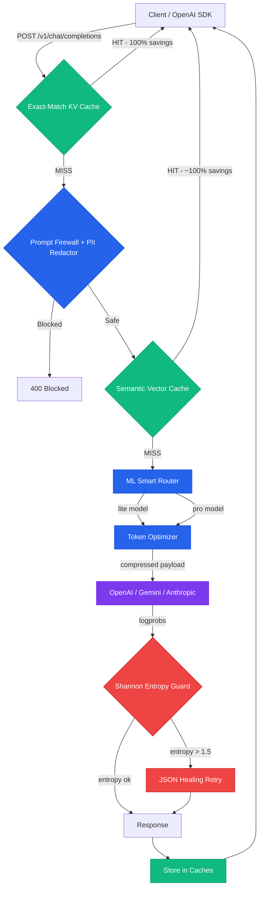

# Axon Bridge — LLM Intelligence & Cost Reduction Middleware

**Production-grade, drop-in OpenAI proxy with autonomous token compression, multi-provider routing, agentic protections, and a real-time observability dashboard.**

**Author:** [Chaitanya Sharma](https://github.com/chaitanya-sharmaa/axon) · chaitanyasharma04uk@gmail.com

```bash
pip install axon-bridge
axon serve
# Dashboard → http://localhost:8080/dashboard
```

> **Drop-in OpenAI proxy.** Point any OpenAI SDK client at Axon instead of `api.openai.com` — no other code changes needed. Get automatic token savings, multi-provider routing, and full observability in return.

---

## 🚀 What is Axon Bridge?

Axon Bridge is a high-performance LLM proxy and intelligence layer. It intercepts standard OpenAI API requests, automatically compresses token bloat, routes to the best model tier, enforces security policies, and returns a standard OpenAI-formatted response — all transparently.

Under the hood it uses **LiteLLM**, meaning it natively routes to 100+ providers (OpenAI, Gemini, Anthropic, AWS Bedrock, Ollama, and more) without any client changes.

```
Your App (OpenAI SDK)
        │  POST /v1/chat/completions
        ▼
┌──────────────────────────────────────────┐
│              AXON BRIDGE                 │
│  • Exact-Match KV Cache (100% savings)  │
│  • Semantic Cache (vector similarity)   │
│  • PII Redaction + Prompt Firewall      │
│  • Token Compression (8 strategies)     │
│  • ML Smart Router (lite ↔ pro)         │
│  • Shannon Entropy Hallucination Guard  │
│  • Streaming Budget Circuit Breaker     │
└──────────────────────────────────────────┘
        │  Compressed, safe request
        ▼
   OpenAI / Gemini / Anthropic / Ollama
```

---

## 📊 Verified Benchmarking Results

All **220/220** tests in CI are passing. Benchmarks run against real-world complex JSON payloads.

### Scenario: Codebase Context for AI Coding Agents (AST Graph)

*Payload: A 4,800+ token JSON graph representing a React codebase's Abstract Syntax Tree, typical of agentic coding workflows.*

| Turn | Action | Axon Strategy | Result |
|---|---|---|---|
| **Turn 1** | Architecture question | *Axon Graph Compression* | ✅ **39.3% API Token Savings** |
| **Turn 2** | Identical repeated question | *Exact-Match KV Cache* | ✅ **100% Token Savings** — $0 cost, 5ms latency |
| **Turn 3** | Follow-up question | *Stateful Threads* | ✅ **99.9% Network Bandwidth Saved** + 39.1% API savings |

---

## ✨ Feature Overview

### 🗜️ 1. Token Compression Engine (8 Strategies)

Axon's `TokenOptimizer` benchmarks every incoming request across 8 encoding strategies and picks the one with the best compression ratio — automatically, per request.

| Strategy | Best For | Savings |
|---|---|---|
| `graph` | AST/dependency graphs | ~39% |
| `schema_values` | Database schemas with repetitive structure | ~25% |
| `generic` | General-purpose JSON flattening | ~20% |
| `generic_delta` | Repeated JSON across turns | ~30% |
| `generic_session` | Multi-turn stateful sessions | ~25% |
| `graph_delta` | Repeated graph context across turns | ~35% |
| `graph_session` | Stateful graph sessions | ~30% |
| `json` | Standard JSON pass-through (baseline) | 0% |

**Zero semantic loss** — compression is purely structural (removes JSON syntax, flattens nesting). The LLM receives equivalent information in fewer tokens.

---

### 🤖 2. ML Smart Router

Axon uses a local **sentence-transformer ML model** (`all-MiniLM-L6-v2`, ~80MB) to classify the semantic intent of every prompt and route to the cheapest appropriate model tier automatically.

```
Prompt: "What's the weather like today?"
  → Classified: casual_chat (Confidence: 0.87)
  → Routed: gpt-4o → gpt-4o-mini (75% cheaper)

Prompt: "Analyze this legal contract and identify all liability clauses..."
  → Classified: complex_reasoning (Confidence: 0.91)
  → Routed: gpt-4o-mini → gpt-4o (full capability)
```

**Supported families:**
- OpenAI: `gpt-4o` ↔ `gpt-4o-mini`
- Anthropic: `claude-3-5-sonnet` ↔ `claude-3-5-haiku`
- Gemini: `gemini-2.5-pro` ↔ `gemini-2.5-flash`

**Smart Fallback Cascading:** On `429/503`, Axon automatically retries down the model tier chain until a response is obtained.

---

### ⚡ 3. Multi-Layer Caching

Two caching layers ensure repeated requests cost $0.

**Exact-Match KV Cache (L1)**
- SHA-256 hash of the full request payload
- 1-hour TTL, 1,000 entry LRU
- **100% token savings, ~5ms latency** for cache hits

**Semantic Vector Cache (L2)**
- Uses cosine similarity embeddings to find *semantically equivalent* prior questions
- Returns cached answers to paraphrased versions of the same question
- Configurable similarity threshold

---

### 🛡️ 4. Agentic Protections

| Protection | What it does |
|---|---|
| **Prompt Firewall** | Blocks 25+ known jailbreak and prompt-injection patterns |
| **PII Redactor** | Auto-redacts emails, SSNs, credit cards, phone numbers (incl. international) before sending to LLM |
| **Shannon Entropy Guard** | Parses `logprobs` and computes $E = -\sum p \log_2 p$. Blocks responses if entropy > 1.5 (hallucination risk) |
| **JSON Healing Loop** | On malformed JSON output, silently asks the LLM to fix it and retries (up to 3 times) |
| **Schema Validator** | Validates LLM JSON output against user-provided JSON Schema |
| **Vision Downscaler** | Strips 4K images to 768px before sending to reduce vision token costs |
| **Streaming Circuit Breaker** | Counts tokens mid-stream and kills the connection if agent exceeds its per-request USD budget |

---

### 💬 5. Stateful Threads API

The Stateful Threads API eliminates the need to upload your entire message history on every turn. Your client sends only the new message; Axon rehydrates the full history from SQLite/Redis and forwards it to the LLM.

```python
# Client sends ONLY the new message (5 tokens instead of 10,000)
client.chat.completions.create(
    model="gpt-4o",
    messages=[{"role": "user", "content": "Follow up question here"}],
    extra_headers={"X-Axon-Stateful-Thread": "true", "X-Axon-Session-ID": "my-session"}
)
# Axon rehydrates 10,000 tokens from SQLite locally — 0 network upload cost
```

**Result:** 99% network bandwidth reduction, ~20% API token reduction.

---

### 🧠 6. Memory & Fact Extraction

Axon automatically extracts semantic facts from user conversations and injects them as context in future turns.

```
User: "My name is Chaitanya and I work at Google."
  → Axon extracts: ["name: Chaitanya", "employer: Google"]
  → Stored in session memory

Next turn, Axon injects:
  System: "Memory: [name: Chaitanya, employer: Google]"
```

---

### 📁 7. Native RAG & File Attachments

The Assistants API supports file uploads with native vector search:

```python
# Upload a document
file = client.files.create(file=open("document.pdf", "rb"), purpose="assistants")

# Attach to a message — Axon vectorizes and stores it locally
client.beta.threads.messages.create(
    thread_id=thread.id,
    role="user",
    content="Summarize the key points",
    attachments=[{"file_id": file.id, "tools": [{"type": "file_search"}]}]
)
```

Axon uses `sentence-transformers` to embed document chunks and performs cosine similarity search at query time. All vector storage is fully local — no external vector DB needed.

---

### 🔧 8. Tool / Function Call Compression

When using OpenAI function calling, the verbose JSON Schema tool definitions can cost thousands of tokens per request. Axon compresses them to dense Python function signatures:

```python
# Before (400+ tokens of JSON Schema):
{"type": "function", "function": {"name": "get_weather", "parameters": {"type": "object", "properties": {"location": {"type": "string", "description": "The city name"}, ...}}}}

# After (30 tokens):
def get_weather(location: str  # The city name) -> None:
    """Get the current weather for a location."""
    pass
```

---

### 👥 9. Multi-Tenant Quota Management

Track and enforce per-tenant USD spend limits with atomic precision.

```python
# Set a $10/month quota for tenant "acme-corp"
requests.post("/admin/quotas/acme-corp", json={"quota_usd": 10.0})

# Tenant identifies itself via header
client.chat.completions.create(
    ...,
    extra_headers={"X-Axon-Tenant-ID": "acme-corp"}
)
# Once $10 is spent → 429 Too Many Requests
```

Spend is tracked atomically in SQLite or Redis. Supports multiple API keys with round-robin load balancing via comma-separated `OPENAI_API_KEY`.

---

### 🤝 10. OpenAI Assistants API Compatibility

Full drop-in support for `client.beta.threads.*` — no SDK changes needed.

```python
import openai
client = openai.OpenAI(base_url="http://localhost:8080/v1", api_key="any")

thread = client.beta.threads.create()
client.beta.threads.messages.create(thread_id=thread.id, role="user", content="Hello!")
run = client.beta.threads.runs.create(thread_id=thread.id, assistant_id="asst_abc")
# Streaming, tool use, and file attachments all supported
```

---

## 📈 Real-Time Observability Dashboard

Access the built-in dashboard at **`http://localhost:8080/dashboard`**.

```bash
# Build the dashboard (one-time)
cd dashboard && npm install && npm run build
```

The dashboard has 4 tabs:

### Metrics Tab
- **Token savings counter** (cumulative, live)
- **Estimated cost saved** in USD
- **Cache hit rate** chart
- **Latency over time** area chart

### Live Request Firehose Tab
A real-time table of the last 100 requests through Axon:

| Column | Description |
|---|---|
| Time | Exact timestamp |
| Model | Which model was actually used (may differ from requested due to smart routing) |
| Latency | End-to-end response time in ms |
| Tokens (P/C/T) | Prompt / Completion / Total token counts |
| Cost | Estimated USD cost |
| Cache Hit | Whether this was served from cache (HIT = $0 cost) |
| Status | HTTP status code |

### Cache Explorer Tab
Browse all entries in the live Semantic Cache — see which prompts are cached, their hashed context keys, and when they were stored.

### Feature Flags Tab
Toggle all Axon features on/off at runtime **without restarting the server**:

| Flag | What disabling it does |
|---|---|
| **Semantic Routing** | All requests use the exact model you specified — no smart tier switching |
| **Exact-Match Cache** | Every request hits the LLM — no KV cache short-circuiting |
| **Tool Compression** | Tool/function definitions sent verbatim (full token cost) |
| **RAG Context** | File attachments not searched; no document context injected |

> **Security:** If `AXON_ADMIN_API_KEY` is set in `.env`, all admin endpoints (`/admin/*`) require a `Bearer <key>` authorization header. Without it, all admin access is blocked.

---

## ⚙️ Configuration Reference

### Core Settings

| Variable | Default | Description |
|---|---|---|
| `AXON_HOST` | `127.0.0.1` | Bind address (`0.0.0.0` to expose on network) |
| `AXON_PORT` | `8080` | Listen port |
| `OPENAI_API_KEY` | — | Your upstream LLM API key (comma-separated for load balancing) |
| `AXON_DEFAULT_MODEL` | `gpt-4o` | Default model when none is specified |

### Caching & Compression

| Variable | Default | Description |
|---|---|---|
| `AXON_ENABLED_FORMATS` | `(all 8)` | Comma-separated list of compression strategies to benchmark |
| `AXON_TOKENIZER_MODEL` | `cl100k_base` | Tokenizer for token count estimation |
| `AXON_SEMANTIC_CACHE` | `true` | Enable/disable semantic vector cache |
| `AXON_ENTROPY_THRESHOLD` | `1.5` | Shannon entropy threshold for hallucination guard |

### Stateful Compression (Advanced)

| Variable | Default | Description |
|---|---|---|
| `AXON_ENABLE_STATEFUL_COMPRESSION` | `false` | Enable TOON/TRON destructive deduplication. **Only safe with Anthropic/Gemini provider caching.** |
| `AXON_ENABLE_GEMINI_PROMPT_CACHE` | `false` | Inject `cache_control` hints for Gemini Context Caching (paid plan only) |

### Memory & Persistence

| Variable | Default | Description |
|---|---|---|
| `AXON_MEMORY_TYPE` | `sqlite` | Memory backend (`sqlite` or `redis`) |
| `AXON_MEMORY_DB_PATH` | `./axon_sessions.db` | SQLite file path. **Never use `/tmp/` in production — data is lost on restart.** |
| `AXON_REDIS_URL` | `redis://localhost:6379/0` | Redis connection URL (when `AXON_MEMORY_TYPE=redis`) |

### Security & Quotas

| Variable | Default | Description |
|---|---|---|
| `AXON_ADMIN_API_KEY` | — | Bearer token required for all `/admin/*` endpoints. Leave unset for open dev access. |
| `AXON_REQUIRE_API_KEY` | `false` | Enforce `X-API-Key` on all proxy requests |
| `AXON_ENABLE_TENANT_QUOTAS` | `false` | Enable per-tenant USD spend tracking and enforcement |
| `AXON_CORS_ORIGINS` | — | Comma-separated allowed CORS origins (e.g. `http://localhost:3000`) |

### Feature Flags (Runtime-Toggleable)

| Variable | Default | Description |
|---|---|---|
| `AXON_ENABLE_SEMANTIC_ROUTING` | `true` | ML-powered lite/pro model routing |
| `AXON_ENABLE_EXACT_MATCH_CACHE` | `true` | SHA-256 exact-match + semantic cache |
| `AXON_ENABLE_TOOL_COMPRESSION` | `true` | Compress JSON Schema tool definitions |
| `AXON_ENABLE_RAG_CONTEXT` | `true` | File attachment vector search |

---

## 🔌 API Reference

### OpenAI-Compatible Endpoints

| Method | Path | Description |
|---|---|---|
| `POST` | `/v1/chat/completions` | Chat completions (streaming + non-streaming) |
| `GET` | `/v1/models` | List available models |
| `POST` | `/v1/embeddings` | Embeddings proxy |
| `POST` | `/v1/files` | Upload files for RAG |
| `GET` | `/v1/files/{id}` | Retrieve file metadata |
| `POST` | `/v1/threads` | Create a stateful thread |
| `POST` | `/v1/threads/{id}/messages` | Add message to thread |
| `POST` | `/v1/threads/{id}/runs` | Execute a thread run |
| `GET` | `/v1/threads/{id}/messages` | List thread messages |

### Custom Axon Headers

| Header | Description |
|---|---|
| `X-Axon-Session-ID` | Session ID for memory/fact extraction |
| `X-Axon-Stateful-Thread: true` | Enable stateful thread rehydration |
| `X-Axon-Tenant-ID` | Tenant identifier for quota tracking |
| `X-Axon-Max-Spend: 0.05` | Per-request USD budget (stream circuit breaker) |

### Response Headers

| Header | Description |
|---|---|
| `x-axon-metrics` | JSON blob: `{original_tokens, compressed_tokens, savings_pct}` |
| `x-axon-cost-saved-usd` | Estimated dollar savings for this request |
| `x-axon-cache` | `HIT` if response served from cache |

### Admin Endpoints

> **Note:** All `/admin/*` endpoints require `Authorization: Bearer <AXON_ADMIN_API_KEY>` if the key is set.

| Method | Path | Description |
|---|---|---|
| `GET` | `/admin/features` | Get current feature flag states |
| `POST` | `/admin/features` | Toggle feature flags at runtime |
| `GET` | `/admin/requests` | Live request firehose (last 100) |
| `GET` | `/admin/cache` | Semantic cache contents |
| `GET` | `/admin/quotas/{tenant_id}` | Get tenant quota & spend |
| `POST` | `/admin/quotas/{tenant_id}` | Set tenant quota |
| `GET` | `/metrics` | Prometheus metrics endpoint |
| `GET` | `/dashboard` | React observability dashboard |
| `GET` | `/docs` | Interactive OpenAPI docs |

---

## 🏃 Quick Start

```bash
# 1. Install
pip install axon-bridge

# 2. Configure
cp .env.example .env
# Edit .env and set OPENAI_API_KEY=your-key

# 3. Run
axon serve

# 4. Point your app at Axon
import openai
client = openai.OpenAI(
    base_url="http://localhost:8080/v1",
    api_key="any-value"  # Axon uses the key from .env
)
response = client.chat.completions.create(
    model="gpt-4o",
    messages=[{"role": "user", "content": "Hello!"}]
)
# Check x-axon-metrics header for savings report
```

### Docker

```bash
docker-compose up
# Axon → http://localhost:8080
# Dashboard → http://localhost:8080/dashboard
```

---

## 🛠️ Architecture



---

## 📜 License

**MIT License** — Copyright (c) 2026 Chaitanya Sharma
