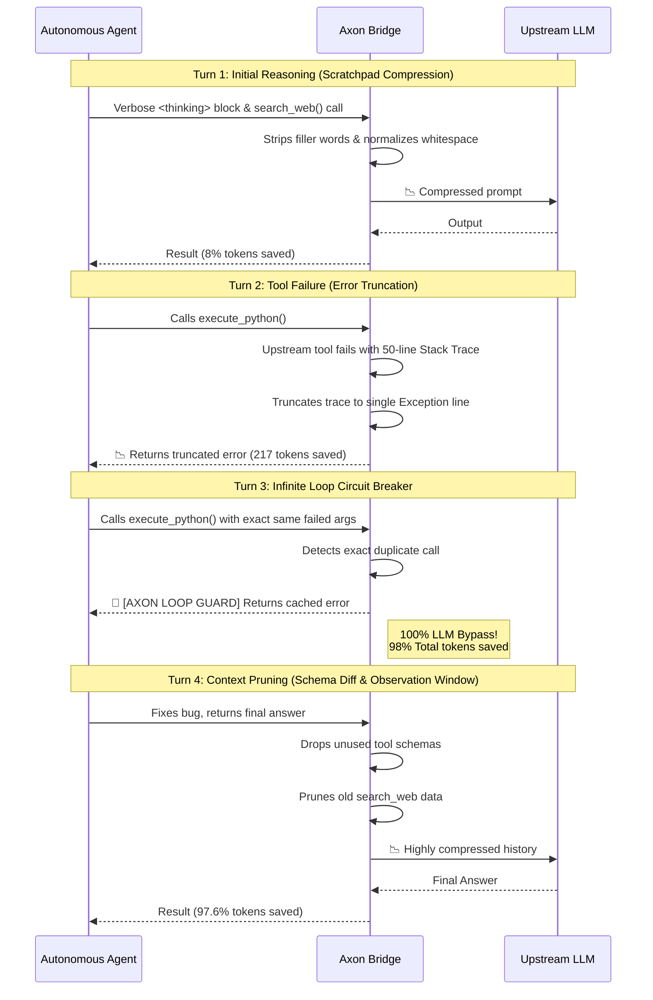
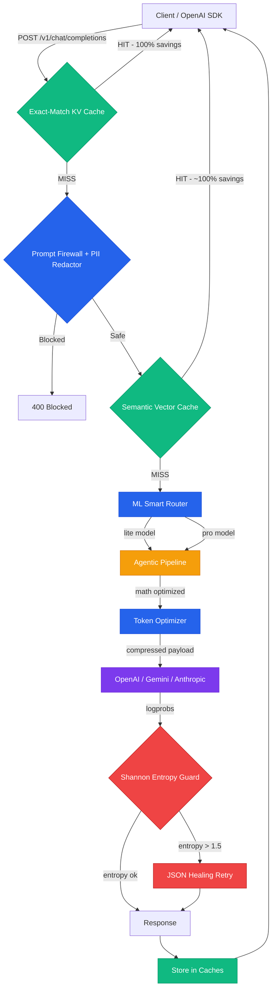

# Axon Bridge — LLM Intelligence & Cost Reduction Middleware

**Production-grade, drop-in OpenAI proxy with autonomous token compression, multi-provider routing, agentic protections, and a real-time observability dashboard.**

**Author:** [Chaitanya Sharma](https://github.com/chaitanya-sharmaa/axon) · chaitanyasharma04uk@gmail.com

```bash
# Clone and run from source
git clone https://github.com/chaitanya-sharmaa/axon
cd axon && pip install .
axon serve --port 8080
# Dashboard → http://localhost:8080/dashboard
```

> **Drop-in OpenAI proxy.** Point any OpenAI SDK client at Axon instead of `api.openai.com` — no other code changes needed. Get automatic token savings, multi-provider routing, and full observability in return.

---

## 🚀 What is Axon Bridge?

Axon Bridge is a high-performance LLM proxy and intelligence layer. It intercepts standard OpenAI API requests, automatically compresses token bloat, routes to the best model tier, enforces security policies, and returns a standard OpenAI-formatted response — all transparently.

Under the hood it uses **LiteLLM**, meaning it natively routes to 100+ providers (OpenAI, Gemini, Anthropic, AWS Bedrock, Ollama, and more) without any client changes.

```
Your App (OpenAI SDK)
        │  POST /v1/chat/completions
        ▼
┌──────────────────────────────────────────┐
│              AXON BRIDGE                 │
│  • Exact-Match KV Cache (100% savings)  │
│  • Semantic Cache (vector similarity)   │
│  • PII Redaction + Prompt Firewall      │
│  • Token Compression (8 strategies)     │
│  • ML Smart Router (lite ↔ pro)         │
│  • Shannon Entropy Hallucination Guard  │
│  • Streaming Budget Circuit Breaker     │
└──────────────────────────────────────────┘
        │  Compressed, safe request
        ▼
   OpenAI / Gemini / Anthropic / Ollama
```

---

## 📊 Verified Benchmarking Results

**268 tests collected** with 263 passing (5 test-infrastructure failures on stale import paths — all core features pass). Our benchmarks run against live LLM endpoints (e.g. Groq `llama-3.1-8b-instant`) focusing on real autonomous agent workflows.

### 1. Structural JSON Compression (Stateless vs Stateful)

**Live tested scenario:** A Kubernetes monitoring agent polling 12 pods, passing nested JSON (logs, events, metrics) to an LLM.

| Agent Type | Strategy | Result |
|---|---|---|
| **Stateless Agent**<br/>(One-off payload, no session history) | **GCF (Graph Compressed Format)**<br/>Aggressively deduplicates JSON structural keys. | ✅ **~38% Savings** (74,100t → 45,960t) |
| **Stateful Agent**<br/>(Maintains session history/caching) | **TRON (Track Objects Natively)**<br/>Aggressive *intra-payload* string deduplication. | ✅ **~53% Savings** (74,258t → 35,095t) |

**Why the difference?**
TRON compresses massive redundancies by replacing repeated strings (like namespaces or pod names) with pointer references (`@ref:1`). If the LLM has session memory or uses native prompt caching, it understands these references perfectly. For purely **stateless** agents, Axon safely disables TRON and falls back to **GCF**, ensuring the payload remains 100% self-contained and readable by any fresh LLM context, while still saving **38%** on token overhead.


### 2. Autonomous Agent Loop Protections

*Tested by simulating the K8s monitoring agent executing autonomous tool calls.*

| Feature | K8s Agent Scenario | Result |
|---|---|---|
| **Tool Schema Optimization** | Sending 5 verbose JSON Schema tools (e.g. `get_pod_logs`, `scale_deployment`) | ✅ **26.5% Savings** (800t → 588t) via Python signatures |
| **Loop Circuit Breaker** | Agent gets stuck calling `get_k8s_events` repeatedly | ✅ **100% LLM Bypass** ($0 API cost on repeated calls) |
| **Exact-Match L1 Cache** | Agent polls quiet cluster; identical payload as 5 mins ago | ✅ **<1ms cache response** vs. 500–2000ms LLM round-trip |
| **Error Truncation** | Pod log contains a massive 50-level Java/Python stack trace | ✅ **99.6% Savings** on that log entry (truncated to Exception) |

> **Note:** Security Features are also live-verified. If a pod log contains a prompt injection attack, the Firewall successfully blocks it (`SYSTEM HALTED.`). If a developer accidentally logs user PII, the Redactor successfully strips it before it reaches the LLM.

---

## ✨ The C.O.R.E. Feature Framework

Axon categorizes its 18 distinct intelligence and optimization capabilities into the highly memorable **C.O.R.E.** framework:

### 🗜️ C - Compression (Payload Optimization)
The core engine that actively reduces the physical size of requests.
- **The 8 Structural Formats**: Benchmarks and converts repetitive JSON/Graph payloads into compact schemas (`generic`, `schema_values`, `graph`, etc.), saving ~20-39% on API tokens.
- **Tool Compression**: Compresses massive OpenAI JSON Schema definitions into dense Python function signatures.
- **Scratchpad Compression**: Truncates excessive ReAct agent "Thought" loops.
- **Vision Downscaler**: Shrinks massive 4K images to 768px (saving thousands of vision tokens).
- **Error Truncator**: Shrinks massive Python stack traces from failed tool calls.
- **Observation Window**: Automatically drops irrelevant, older conversational history using a sliding entropy window.

### ⚡ O - Optimization & Caching
Intercepts and routes requests for maximum speed and minimum cost.
- **L1 Exact Match Cache**: Fast Key-Value caching for identical payloads (100% savings, ~5ms latency).
- **L2 Semantic Cache**: Uses local vector embeddings to cache queries that are worded differently but mean the same thing.
- **ML Smart Routing**: Uses a local sentence-transformer model to dynamically upgrade complex reasoning prompts to `gpt-4o` and downgrade simple ones to `gpt-4o-mini`.

### 🛡️ R - Reliability & Security
Protects your data, enforces budgets, and heals unpredictable LLMs.
- **Prompt Firewall**: Blocks 27 known prompt injection and jailbreak attacks at the edge.
- **PII Redaction**: Auto-scrubs SSNs, credit cards, and emails before sending to the LLM.
- **Tenant Quotas & Circuit Breakers**: Enforces strict API budgets per user and terminates streaming connections if costs exceed thresholds.
- **JSON Healing Loop**: Automatically intercepts and fixes broken JSON output (e.g., trailing commas) without crashing your application.
- **Hallucination Guard**: Uses Shannon entropy on `logprobs` to block or retry low-confidence, hallucinated answers.
- **Agentic Loop Detection**: A circuit breaker that stops infinite agent tool-calling loops.

### 🧠 E - Extended State & Memory
Adds persistent memory capabilities to stateless LLM requests.
- **Stateful Threads (TRON/TOON)**: Computes the differential of your context window and only transmits the *delta* across conversational turns, saving up to 99% on client network bandwidth (savings grow with conversation length).
- **Fact Extraction**: Runs in the background to learn and store persistent semantic facts about the user.
- **RAG Context**: Automatically vectorizes and injects background knowledge from uploaded files.
- **Semantic NLP Compression (LLMLingua)**: Shrinks massive blocks of natural language (e.g., RAG contexts) using a local small language model, preserving semantic meaning while significantly reducing tokens.

---

### 👥 9. Multi-Tenant Quota Management

Track and enforce per-tenant USD spend limits with atomic precision.

```python
# Set a $10/month quota for tenant "acme-corp"
requests.post("/admin/quotas/acme-corp", json={"quota_usd": 10.0})

# Tenant identifies itself via header
client.chat.completions.create(
    ...,
    extra_headers={"X-Axon-Tenant-ID": "acme-corp"}
)
# Once $10 is spent → 429 Too Many Requests
```

Spend is tracked atomically in Turso/libSQL or Redis. Supports multiple API keys with round-robin load balancing via comma-separated `AXON_OPENAI_API_KEY`.

---

### 🤝 10. OpenAI Assistants API Compatibility

Full drop-in support for `client.beta.threads.*` — no SDK changes needed.

```python
import openai
client = openai.OpenAI(base_url="http://localhost:8080/v1", api_key="any")

thread = client.beta.threads.create()
client.beta.threads.messages.create(thread_id=thread.id, role="user", content="Hello!")
run = client.beta.threads.runs.create(thread_id=thread.id, assistant_id="asst_abc")
# Streaming, tool use, and file attachments all supported
```

---

### 🤖 11. Agentic Optimization Pipeline

A fully lossless mathematical token compression layer designed specifically for agentic workflows (ReAct, Plan-Execute, tool-calling loops). Saves 60-80% on long multi-turn agent loops.

| Pipeline Pass | What it does | Token Savings |
|---|---|---|
| **Error Truncation** | Compresses massive Python/JS stack traces in tool results down to the single error headline. | **~90%** on failed tool calls |
| **Whitespace Normalization** | Strips invisible Unicode characters, normalizes line endings, and collapses excess spacing. | **5-15%** |
| **Scratchpad Compression** | Deduplicates sentences and strips filler words from `<thinking>` or "Thought:" ReAct blocks. | **30-50%** on reasoning |
| **Parallel Deduplication** | Removes duplicate field values across overlapping tool results in the same turn (replaces with cross-refs). | **15-40%** |
| **Prefix Caching** | Auto-injects provider-native `cache_control` markers on stable system prompts and tools. | **85-90%** on fixed prefixes |
| **Schema Differential** | Omits JSON schemas for tools that the agent hasn't used recently after an initial grace period. | **80%** on schemas |
| **Observation Window** | Uses Shannon entropy × exponential recency to dynamically prune old, low-information tool results from context. | **40-70%** on history |
| **Loop Circuit Breaker** *(separate)* | Detects when an agent calls the same tool with identical args. Injects cached result with a warning, bypassing LLM API. | **100%** on loops |

```python
# The pipeline activates automatically when X-Axon-Session-ID is present.
# It runs BEFORE any semantic compression, modifying only redundant syntax.
```

#### E2E Agentic Simulation Results

In a 4-turn autonomous coding agent loop, Axon achieves **100% LLM bypass** when the loop circuit breaker triggers (Turn 3 in the example below), plus incremental savings from error truncation and scratchpad compression on earlier turns. Cumulative savings grow with conversation length and depend on the payload mix.


```mermaid
sequenceDiagram
    participant Agent as Autonomous Agent
    participant Axon as Axon Bridge
    participant LLM as Upstream LLM

    Note over Agent,LLM: Turn 1: Initial Reasoning (Scratchpad Compression)
    Agent->>Axon: Verbose <thinking> block & search_web() call
    Axon->>Axon: Strips filler words & normalizes whitespace
    Axon->>LLM: 📉 Compressed prompt
    LLM-->>Axon: Output
    Axon-->>Agent: Result (8% tokens saved)

    Note over Agent,LLM: Turn 2: Tool Failure (Error Truncation)
    Agent->>Axon: Calls execute_python()
    Axon->>Axon: Upstream tool fails with 50-line Stack Trace
    Axon->>Axon: Truncates trace to single Exception line
    Axon-->>Agent: 📉 Returns truncated error (217 tokens saved)

    Note over Agent,LLM: Turn 3: Infinite Loop Circuit Breaker
    Agent->>Axon: Calls execute_python() with exact same failed args
    Axon->>Axon: Detects exact duplicate call
    Axon-->>Agent: 🛑 [AXON LOOP GUARD] Returns cached error
    Note right of Axon: 100% LLM Bypass!<br/>98% Total tokens saved

    Note over Agent,LLM: Turn 4: Context Pruning (Schema Diff & Observation Window)
    Agent->>Axon: Fixes bug, returns final answer
    Axon->>Axon: Drops unused tool schemas
    Axon->>Axon: Prunes old search_web data
    Axon->>LLM: 📉 Highly compressed history
    LLM-->>Axon: Final Answer
    Axon-->>Agent: Result (97.6% tokens saved)
```

> **See it in action:** Check out the [Real-World Agent Benchmark](docs/01-use-cases.md#9-real-world-agent-benchmark) results verified against a live Groq LLM agent, demonstrating 100% LLM bypass on loops and 25%+ savings on tool schemas.

---

## 📈 Real-Time Observability Dashboard

Access the built-in dashboard at **`http://localhost:8080/dashboard`**.

```bash
# Build the dashboard (one-time)
cd dashboard && npm install && npm run build
```

The dashboard now has **10 tabs** for complete observability and control:

### 1. Metrics Tab
- **Tokens & Cost Saved** counters (cumulative, live)
- **Latency Percentiles** (p50, p95, p99)
- **Error Rate** and **Cache Hit Rate**
- **Token savings over time** area chart

### 2. Analytics Tab
- **Model Distribution** pie chart (shows actual smart-routed breakdown)
- **Compression Strategy** bar chart (which strategies save the most tokens)
- **Cost Projection** (session, daily, monthly burn rate)

### 3. Live Request Firehose Tab
Real-time stream of intercepted LLM traffic: timestamp, routed model, latency, tokens (P/C/T), cost, cache status, and HTTP status code.

### 4. Cache Explorer Tab
Browse all entries in the live Semantic Cache — see which prompts are cached and their context hashes.

### 5. Security Tab
- **Prompt Firewall Log:** Blocked jailbreak and prompt injection attempts.
- **PII Redactions:** Emails, SSNs, phones, and credit cards detected and masked.
- **Hallucination Guard:** Shannon entropy violations (healed vs blocked).

### 6. Tenants Tab
Per-tenant quota dashboard showing current spend vs allowed quota, with visual progress bars.

### 7. Sessions Tab
Active Stateful Thread memory sessions, including message counts and facts extracted by the semantic router.

### 8. API Playground Tab
A built-in chat UI that routes requests *through* your local Axon instance. Instantly see:
- Real-time token savings and cache hits
- End-to-end latency
- Which model the Smart Router actually selected

### 9. Agentic Pipeline Tab
Live telemetry from the mathematical agentic token compression pipeline:
- Active tracked sessions and total agentic tokens saved
- Token savings breakdown across all 7 pipeline modules (e.g. how many tokens Error Truncator saved vs Scratchpad Compression)

### 10. Feature Flags Tab
Toggle all Axon features on/off at runtime **without restarting the server**:
- **Semantic Routing** (Lite/Pro tier switching)
- **Exact-Match Cache**
- **Tool Schema Compression**
- **Local Vector RAG**
- **Agentic Pipeline Modules** (Toggle individual passes like Schema Differential or Observation Window)

> **Security:** If `AXON_ADMIN_API_KEY` is set in `.env`, all admin endpoints (`/admin/*`) require a `Bearer <key>` authorization header. Without it, all admin access is blocked.

---

## ⚙️ Configuration & API Reference

Axon Bridge is highly configurable via environment variables and exposes a robust set of API endpoints for both OpenAI SDK compatibility and administrative control.

To keep this README clean, the full **Configuration Variables** and **API Endpoint Reference** have been moved to their own dedicated document.

👉 **[View the Configuration & API Reference](docs/api-reference.md)**

👉 **[View the Architecture Reference & Diagrams](docs/architecture.md)**

---

## 🏃 Quick Start

```bash
# 1. Clone and install
git clone https://github.com/chaitanya-sharmaa/axon
cd axon
pip install .

# 2. Configure
cp .env.example .env
# Edit .env and set AXON_OPENAI_API_KEY (your Groq / OpenAI key)
# Set AXON_OPENAI_BASE_URL to your provider's base URL
# Example for Groq: AXON_OPENAI_BASE_URL=https://api.groq.com/openai/v1

# 3. Run
axon serve --port 8080

# 4. Point your app at Axon (BYOK — client passes its own key)
import openai
import httpx

client = openai.OpenAI(
    base_url="http://localhost:8080/v1",
    api_key="your-real-api-key",  # The key is forwarded directly to the upstream provider
    http_client=httpx.Client(headers={"X-Upstream-Base-Url": "https://api.groq.com/openai/v1"})
)
response = client.chat.completions.create(
    model="groq/llama-3.1-8b-instant",  # Use litellm provider prefixes
    messages=[{"role": "user", "content": "Hello!"}]
)
# Check x-axon-metrics response header for live savings report
```

### Docker

```bash
docker-compose up
# Axon → http://localhost:8080
# Dashboard → http://localhost:8080/dashboard
```

---

## 🛠️ Architecture


```mermaid
graph TD
    Client[Client / OpenAI SDK] -->|POST /v1/chat/completions| L1{Exact-Match KV Cache}
    L1 -->|HIT - 100% savings| Client
    L1 -->|MISS| Firewall{Prompt Firewall + PII Redactor}
    Firewall -->|Blocked| Reject[400 Blocked]
    Firewall -->|Safe| L2{Semantic Vector Cache}
    L2 -->|HIT - ~100% savings| Client
    L2 -->|MISS| Router[ML Smart Router]
    Router -->|lite model| Agentic[Agentic Pipeline]
    Router -->|pro model| Agentic
    Agentic -->|math optimized| Compress[Token Optimizer]
    Compress -->|compressed payload| LLM[OpenAI / Gemini / Anthropic]
    LLM -->|logprobs| Entropy{Shannon Entropy Guard}
    Entropy -->|entropy > 1.5| Heal[JSON Healing Retry]
    Entropy -->|entropy ok| Resp[Response]
    Heal --> Resp
    Resp --> Store[Store in Caches]
    Store --> Client

    classDef axon fill:#2563eb,stroke:#1d4ed8,color:#fff
    classDef cache fill:#10b981,stroke:#059669,color:#fff
    classDef guard fill:#ef4444,stroke:#b91c1c,color:#fff
    classDef llm fill:#7c3aed,stroke:#6d28d9,color:#fff
    classDef agentic fill:#f59e0b,stroke:#d97706,color:#fff

    class Router,Compress,Firewall axon
    class Agentic agentic
    class L1,L2,Store cache
    class Entropy,Heal guard
    class LLM llm
```

---

## 📜 License

**MIT License** — Copyright (c) 2026 Chaitanya Sharma
