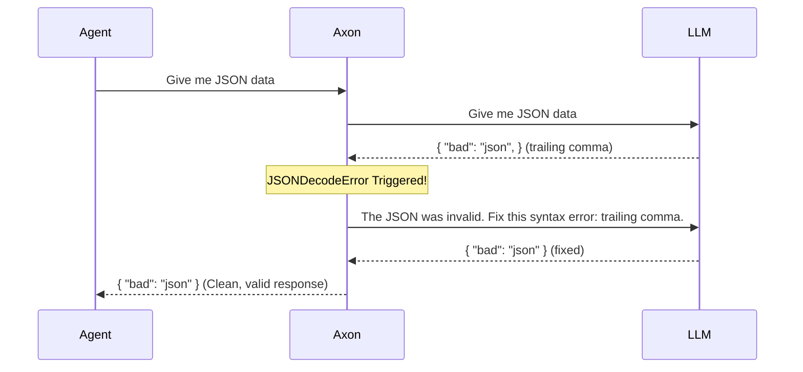
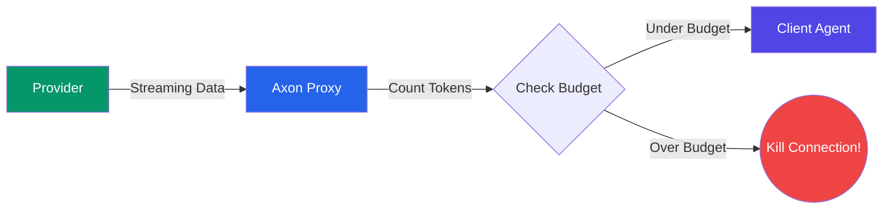

# Use Cases & Feature Examples

Axon Bridge is an agentic middleware that seamlessly intercepts LLM requests, optimizes them mathematically, and adds enterprise-grade resilience. Here are the primary ways to integrate and benefit from it.

---

## 1. The Universal Proxy Engine (LiteLLM Integration)

**Axon vs No Axon:**
| Without Axon | With Axon |
|---|---|
| You must rewrite your SDK code to support `openai`, `anthropic`, and `google-genai`. | **One SDK rules them all.** Send OpenAI-formatted payloads to Axon, and it translates them to 100+ providers automatically. |
| You pay full price for raw, bloated JSON token payloads. | Axon dynamically compresses your payload before it hits the provider, saving up to 70%. |

**How it works:**
Axon intercepts standard `/v1/chat/completions` requests. It compresses the `messages` array, and then uses its embedded LiteLLM engine to translate the payload and route it to the target LLM.

```python
import openai

# 1. Point the client to your local Axon Bridge
client = openai.OpenAI(
    base_url="http://localhost:8080/v1",
    api_key="your-anthropic-api-key", # Pass ANY provider's API key
)

# 2. Seamlessly route to Claude using OpenAI's SDK!
response = client.chat.completions.create(
    model="claude-3-5-sonnet", # Axon translates the payload for Anthropic automatically
    messages=[{"role": "user", "content": "Summarise the latest earnings report..."}],
    stream=True, 
)

# Axon injects savings metrics into the HTTP response headers:
# x-axon-metrics: {"savings_pct": 38.2, "original_tokens": 812, "compressed_tokens": 501}
# x-axon-cost-saved-usd: 0.00156
```

---

## 2. Autonomous JSON Healing (Agentic Resilience)

**Axon vs No Axon:**
| Without Axon | With Axon |
|---|---|
| If the LLM generates a trailing comma or missing quote, your `json.loads()` crashes and your Agent dies. | Axon intercepts the `JSONDecodeError`, automatically appends the error to the message history, and asks the LLM to fix it *before* returning it to your Agent. |



By adding `response_format={"type": "json_object"}`, Axon natively protects your pipelines from syntax crashes.

---

## 3. Streaming Circuit Breaker

**Axon vs No Axon:**
| Without Axon | With Axon |
|---|---|
| A rogue agent gets stuck in an infinite loop, streaming 100,000 tokens of gibberish and draining your API budget. | Pass `X-Axon-Max-Spend: 0.10` in the header. Axon counts tokens mid-stream. If the cost exceeds 10 cents, Axon gracefully terminates the TCP connection. |



---

## 4. Native Python SDK Wrapper (`axon.patch`)

**Goal:** You want JSON Healing and token compression inside a local Python script without standing up a Docker container.

```python
import openai
from axon import patch

# Create a standard AsyncOpenAI client
client = openai.AsyncOpenAI(api_key="sk-your-real-key")

# Patch it with Axon
client = patch(client)

# Use it exactly as before. Axon intercepts the call locally!
response = await client.chat.completions.create(
    model="gpt-4o",
    messages=[{"role": "user", "content": "Huge payload..."}],
    response_format={"type": "json_object"} # JSON Healing activated!
)
```

---

## 5. RAG and Vector DB Integration (LlamaIndex)

**Axon vs No Axon:**
| Without Axon | With Axon |
|---|---|
| You retrieve 10 large documents from a Vector DB. All 10 are sent to the LLM, burning 15k tokens. | Axon uses a fast, local BM25 `TokenOptimizer` post-processor. It scores the documents against the query, drops the irrelevant bottom 25%, and compresses the remaining 75%. You send 4k tokens instead of 15k. |

```python
from integrations.llamaindex import AxonNodePostprocessor
from services.token_optimizer import TokenOptimizer

# Configure the postprocessor
axon_postprocessor = AxonNodePostprocessor(
    optimizer=TokenOptimizer(), 
    model="gpt-4o",
    enable_pruning=True
)

# Apply it in your query engine
query_engine = index.as_query_engine(
    node_postprocessors=[axon_postprocessor]
)

response = query_engine.query("What is the Q3 revenue?")
```