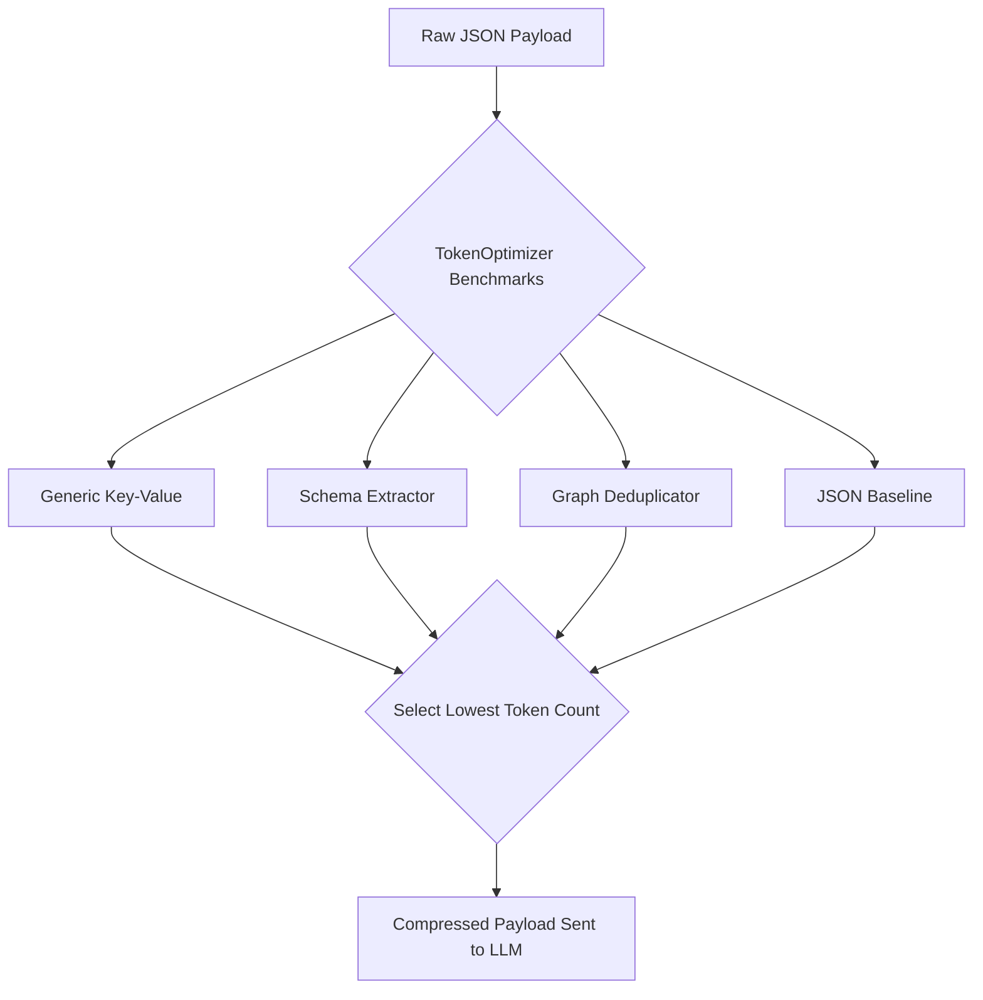
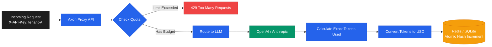

# Core Concepts & Intelligence Architecture

Axon Bridge is more than a string compressor. It is a full intelligence layer that sits between your application and the LLM, actively manipulating payloads to protect your budget, decrease latency, and prevent errors.

---

## 1. Dynamic Encoding & Structural Compression

JSON is notoriously token-heavy due to extensive punctuation (`"`, `{`, `}`, `,`), repeated keys, and whitespace. 

**Axon vs No Axon:**
| Without Axon | With Axon |
|---|---|
| Sending 1,000 JSON items costs 30,000 tokens due to the repeated keys on every single row. | Axon mathematically detects the schema, strips all keys, sends the schema once at the top, and sends raw comma-separated values below it. 30,000 tokens drops to 8,000 tokens. |

Instead of relying on a single compression format, Axon's `TokenOptimizer` takes every inbound JSON payload and **benchmarks it against 8 different encoding strategies simultaneously**. It automatically selects the cheapest one.

---

## 2. Multi-Turn Session Deduplication (TOON & TRON)

The most dramatic token savings (up to 70%+) occur during multi-turn LLM conversations. When an agent continuously polls an API or receives updated context, they often re-send 90% of the same data. 

**Axon vs No Axon:**
| Without Axon | With Axon |
|---|---|
| Turn 1 sends 10KB. Turn 2 changes one variable and sends 10.1KB. The LLM re-reads the entire 10KB context again. | Axon maintains state. Turn 1 sends 10KB. Turn 2 sends ONLY the 0.1KB delta. The LLM processes 99% fewer tokens. |

* **TOON (Token-Oriented Object Notation - "Deltas")**: Axon compares the current payload to the previous turn and sends *only the fields that changed*. 
* **TRON (Token-Reduced Object Notation - "References")**: Axon remembers previously seen long strings and replaces them with tiny references (e.g., `@1`) on subsequent turns.

---

## 3. Advanced Agentic Protections

Axon natively includes interceptors designed to protect autonomous agent workflows:

1. **Vision Payload Downscaling**: Automatically intercepts `base64` images in your payload. Axon uses `Pillow` to silently downscale massive 4K images to 768px/512px while preserving aspect ratio, slashing Vision API costs by up to 85%.
2. **Semantic Cache**: If you send a prompt that is >95% semantically similar to a previous request, Axon intercepts it and instantly returns the cached response.
   * **Benefit:** Zero API tokens used, <50ms latency response.
3. **Smart LLM Routing**: Short, simple payloads sent to expensive models (like `gpt-4o`) are automatically down-routed to cheaper models (like `gpt-4o-mini`).
4. **Tool Schema Pruning**: Axon uses a fast, local **BM25 semantic filter** to dynamically drop irrelevant tools from the context window based on the user's immediate query, saving thousands of tokens per turn without breaking the agent.

---

## 4. Real Dollar Cost Tracking & Tenant Quotas

Engineers care about tokens, but businesses care about dollars.

**Axon vs No Axon:**
| Without Axon | With Axon |
|---|---|
| You find out you overspent your OpenAI budget at the end of the month when you get the invoice. | Pass `X-Axon-Tenant-ID` in the headers. Axon atomically tracks exact dollar spend per user/tenant in Redis. If they hit their budget, Axon blocks them instantly with a `429 Too Many Requests`. |

Axon calculates the actual **USD cost saved** by the compression. This is returned in the API responses or injected into HTTP headers (`x-axon-cost-saved-usd`).

