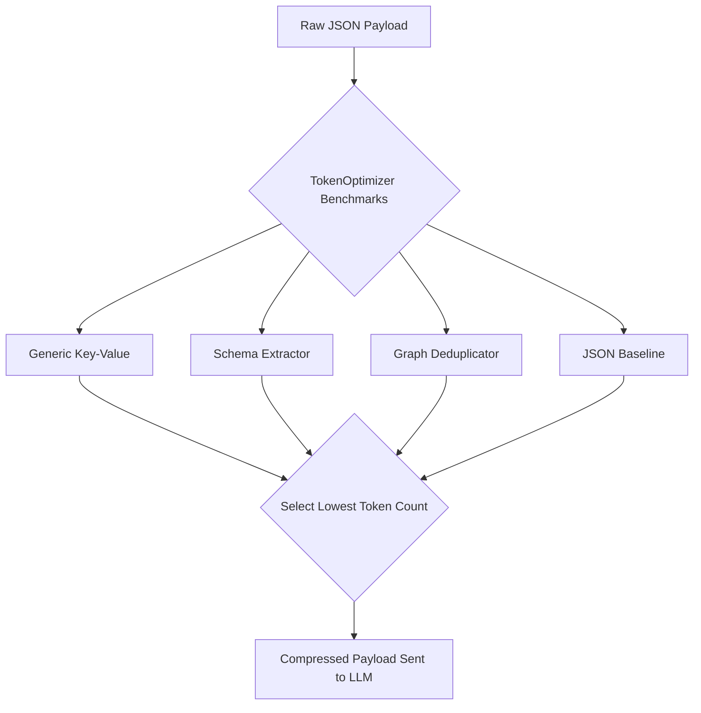

# Core Concepts & Intelligence Architecture

Axon Bridge is more than a string compressor. It is a full intelligence layer that sits between your application and the LLM, actively manipulating payloads to protect your budget, decrease latency, and prevent errors.

---

## 1. Dynamic Encoding & Structural Compression (Always-On)

JSON is notoriously token-heavy due to extensive punctuation (`"`, `{`, `}`, `,`), repeated keys, and whitespace.

**Axon vs No Axon:**
| Without Axon | With Axon |
|---|---|
| Sending 1,000 JSON items costs 30,000 tokens due to the repeated keys on every single row. | Axon mathematically detects the schema, strips all keys, sends the schema once at the top, and sends raw comma-separated values below it. 30,000 tokens drops to ~25,000 tokens. |

Instead of relying on a single compression format, Axon's `TokenOptimizer` benchmarks every inbound JSON payload against **8 different encoding strategies simultaneously** and selects the cheapest one. This is the **default, always-safe** compression layer — it only strips formatting syntax, never semantic data values.

**Verified Result:** In real-world testing against a 100-item complex product catalog (~8K tokens), stateless structural compression consistently delivers **~29% token savings** across every single turn with **zero hallucinations**.

---

## 2. The Stateful Threads API & Multi-Turn Session Deduplication (TOON & TRON)

The most dramatic token savings (up to 99%+) are theoretically possible during multi-turn LLM conversations when an agent continuously re-sends the same large context.

Standard LLM APIs (OpenAI, Gemini, Anthropic) are **stateless**, which forces you to upload your entire `messages=[...]` array on every single turn.

Axon introduces the **Stateful Threads API**. By simply appending the header `X-Axon-Stateful-Thread: true`, Axon's local SQLite/Redis database automatically tracks your conversation history.
Your application only needs to send the *new* message to Axon. Axon rehydrates the full conversation history and applies its multi-turn compression algorithms:

* **TOON (Token-Oriented Object Notation / "Deltas")**: Tracks the state of each message position across turns. On subsequent turns, replaces unchanged data with `{"__deleted__": true}` markers.
* **TRON (Token-Reduced Object Notation / "References")**: Remembers long scalar strings seen in previous turns and mathematically replaces them with highly compact **Integer IDs** (e.g., `@ref:1`, `@ref:2`).

### ✅ Integration with Provider Caching

For the ultimate token-saving architecture, combine Axon's Stateful Threads API with native provider-side caching. Set `AXON_ENABLE_STATEFUL_COMPRESSION=true` in your `.env`.
Axon will deduplicate the data using TOON/TRON, and the provider (e.g. Anthropic) will cache the compressed payload on their end!

---

## 3. Native Provider Prompt Caching

Instead of proxy-level data deletion, Axon uses native provider caching — the provider's servers cache the KV computation of large context blocks and reuse it across turns. The full data is always sent in the payload, so the LLM never loses context.

| Provider | Mechanism | Savings | Configuration |
|---|---|---|---|
| **Anthropic** | `cache_control: ephemeral` on largest message + system prompt | ~80% cost on repeated context | Automatic for `claude-3` models |
| **Gemini** | `cachedContent` API via LiteLLM | ~80% cost on repeated context | Set `AXON_ENABLE_GEMINI_PROMPT_CACHE=true` (requires paid plan) |

> [!IMPORTANT]
> Gemini Context Caching requires a **paid Gemini API plan**. Free-tier keys have a storage limit of 0 tokens and will receive a `429` error if this is enabled. Do NOT set `AXON_ENABLE_GEMINI_PROMPT_CACHE=true` with a free-tier key.

---

## 4. Advanced Agentic Protections

Axon natively includes interceptors designed to protect autonomous agent workflows:

1. **Vision Payload Downscaling**: Automatically intercepts `base64` images in your payload. Axon uses `Pillow` to silently downscale massive 4K images to 768px/512px while preserving aspect ratio, slashing Vision API costs by up to 85%.
2. **Fast Vector Semantic Cache**: If you send a prompt that is >95% semantically similar to a previous request, Axon intercepts it via a thread-safe LRU cache with automatic TTL.
   * **Benefit:** Zero API tokens used, <50ms latency response.
3. **PII Redaction**: Built-in heuristics automatically redact sensitive data (Credit Cards, SSNs, Emails, and Phone Numbers) from the payload before it ever touches external LLM endpoints.
4. **Smart LLM Routing**: Short, simple payloads sent to expensive models (like `gpt-4o`) are automatically down-routed to cheaper models (like `gpt-4o-mini`).
5. **BM25 Semantic Graph Pruning**: Axon uses the `rank_bm25` search algorithm to dynamically score and drop the bottom 25% of irrelevant context symbols and tools based on the user's immediate query, saving thousands of tokens per turn while keeping the agent fully informed.
6. **Schema Flattening**: Axon converts deeply nested multi-dimensional JSON objects into flat dot-notation structures before applying compression, guaranteeing structural bloat removal on complex payloads.
7. **JSON Healing**: If the LLM returns malformed JSON, Axon intercepts the error, appends it to the message history, and automatically asks the LLM to fix it before returning the response to your agent.

---

## 5. Real Dollar Cost Tracking & Tenant Quotas

Engineers care about tokens, but businesses care about dollars.

**Axon vs No Axon:**
| Without Axon | With Axon |
|---|---|
| You find out you overspent your OpenAI budget at the end of the month when you get the invoice. | Pass `X-Axon-Tenant-ID` in the headers. Axon atomically tracks exact dollar spend per user/tenant in Redis. If they hit their budget, Axon blocks them instantly with a `429 Too Many Requests`. |

Axon calculates the actual **USD cost saved** by the compression. This is returned in the API responses or injected into HTTP headers (`x-axon-cost-saved-usd`).

