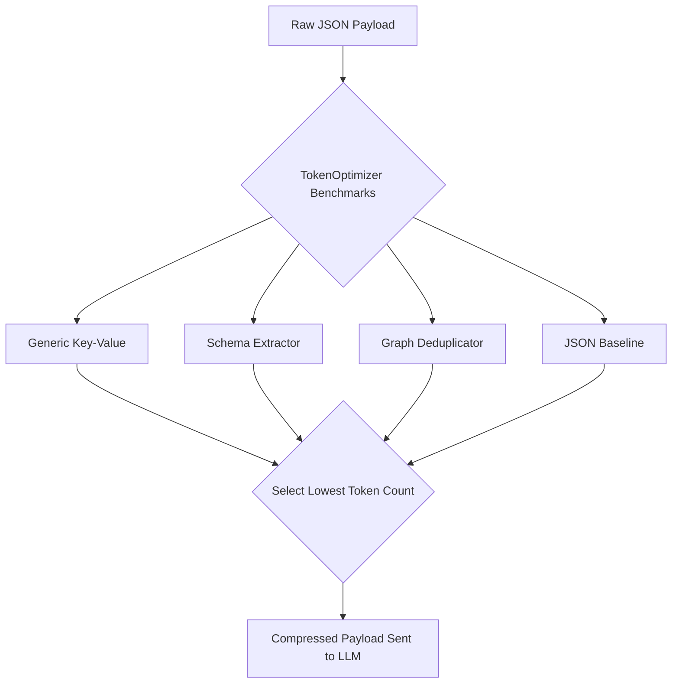
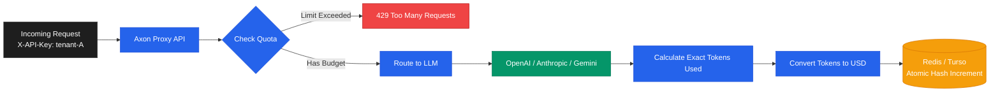

# Core Concepts & Intelligence Architecture

Axon Bridge is more than a string compressor. It is a full intelligence layer that sits between your application and the LLM, actively manipulating payloads to protect your budget, decrease latency, and prevent errors.

---

## 1. Dynamic Encoding & Structural Compression (Always-On)

JSON is notoriously token-heavy due to extensive punctuation (`"`, `{`, `}`, `,`), repeated keys, and whitespace.

**Axon vs No Axon:**
| Without Axon | With Axon |
|---|---|
| Sending 1,000 JSON items costs 30,000 tokens due to the repeated keys on every single row. | Axon mathematically detects the schema, strips all keys, sends the schema once at the top, and sends raw comma-separated values below it. 30,000 tokens drops to ~25,000 tokens. |

Instead of relying on a single compression format, Axon's `TokenOptimizer` benchmarks every inbound JSON payload against **8 different encoding strategies simultaneously** and selects the cheapest one. This is the **default, always-safe** compression layer — it only strips formatting syntax, never semantic data values.

```mermaid
graph TD
    Input[Raw JSON Payload] --> Benchmark{TokenOptimizer Benchmarks}
    
    Benchmark --> S1[Generic Key-Value]
    Benchmark --> S2[Schema Extractor]
    Benchmark --> S3[Graph Deduplicator]
    Benchmark --> S4[JSON Baseline]
    
    S1 --> Pick{Select Lowest Token Count}
    S2 --> Pick
    S3 --> Pick
    S4 --> Pick
    
    Pick --> Output[Compressed Payload Sent to LLM]
```

**Verified Results:**
- On a **live 5,507-token agent payload** (150 modules, real Groq LLM): **39.75% token savings** (5,507t → 3,318t)
- On **repeated JSON payloads** (generic_delta strategy, turn 2): **76.2% token savings** (21t → 5t)
- On **AST graph context** (first send, graph strategy): **53.9% token savings** (117t → 54t)

Compression is purely structural — it only strips formatting syntax and flattens nesting. **Zero semantic data is ever removed.**

---

## 2. The Stateful Threads API (Network Savings)

The most dramatic latency improvements occur during multi-turn LLM conversations. Standard LLM APIs (OpenAI, Gemini, Anthropic) are **stateless**, which forces you to upload your entire `messages=[...]` array on every single turn. This wastes massive amounts of client-side network bandwidth.

Axon introduces the **Stateful Threads API**. By simply appending the header `X-Axon-Stateful-Thread: true`, Axon's local Turso/libSQL or Redis database automatically tracks your conversation history.

**How it works:**
1. Your application only sends the *new* message (a tiny delta) to Axon.
2. Axon rehydrates the full conversation history from its local Turso/libSQL memory.
3. Axon applies safe structural compression (Schema Flattening).
4. Axon sends the full rehydrated payload to the stateless LLM API.

**Benefit:** Your client only transmits the new message over the network (massive bandwidth reduction). The LLM receives a fully rehydrated, structurally compressed context — combining network savings with ~39-53% API token savings from structural compression.

---

## 3. Native Provider Prompt Caching & TRON (API Token Savings)

> [!WARNING]
> **Never enable TRON/TOON against stateless APIs (like standard OpenAI or Ollama).**
> These algorithms physically delete data and replace it with `@ref` pointers. Stateless models have no memory of previous turns, so they will hallucinate when receiving `@ref` pointers.

To achieve **99% API Token Savings**, you must use **Native Provider Caching**. In these setups, the provider's servers cache the physical key-value states, so they can resolve references. When using Anthropic Prompt Caching or paid Gemini `cachedContent`, you can safely enable Axon's destructive deduplication by setting `AXON_ENABLE_STATEFUL_COMPRESSION=true`.

* **TOON (Token-Oriented Object Notation / "Deltas")**: Tracks the state of each message position across turns. On subsequent turns, replaces unchanged data with `{"__deleted__": true}` markers.
* **TRON (Token-Reduced Object Notation / "References")**: Remembers long scalar strings seen in previous turns and mathematically replaces them with highly compact **Integer IDs** (e.g., `@ref:1`, `@ref:2`).

| Provider | Mechanism | Savings | Configuration |
|---|---|---|---|
| **Anthropic** | `cache_control: ephemeral` on largest message + system prompt | ~80% cost on repeated context | Automatic for `claude-3` models |
| **Gemini** | `cachedContent` API via LiteLLM | ~80% cost on repeated context | Set `AXON_ENABLE_GEMINI_PROMPT_CACHE=true` (requires paid plan) |

> [!IMPORTANT]
> Gemini Context Caching requires a **paid Gemini API plan**. Free-tier keys have a storage limit of 0 tokens and will receive a `429` error if this is enabled. Do NOT set `AXON_ENABLE_GEMINI_PROMPT_CACHE=true` with a free-tier key.

---

## 4. Advanced Agentic Protections

Axon natively includes interceptors designed to protect autonomous agent workflows:

1. **Vision Payload Downscaling**: Automatically intercepts `base64` images in your payload. Axon uses `Pillow` to silently downscale massive 4K images to 768px/512px while preserving aspect ratio, reducing Vision API token costs.
2. **Fast Vector Semantic Cache**: If you send a prompt that is semantically similar (above a configurable threshold) to a previous request, Axon intercepts it via a thread-safe LRU cache with automatic TTL.
   * **Live verified:** `x-axon-cache: HIT` response header confirmed on a paraphrased question in the `simulate_gemini.py` demo.
   * **Benefit:** Zero API tokens used for cached responses.
3. **PII Redaction**: Built-in heuristics automatically redact sensitive data (Credit Cards, SSNs, Emails, and Phone Numbers) from the payload before it ever touches external LLM endpoints. **Live verified:** SSN stripped from `"My SSN is 123-456-7890"` — LLM refused to echo it back.
4. **Smart LLM Routing**: Short, simple payloads sent to expensive models are automatically down-routed to cheaper models. Enable with `AXON_ENABLE_SEMANTIC_ROUTING=true`.
5. **BM25 Semantic Graph Pruning**: Axon uses the `rank_bm25` search algorithm to dynamically score and drop the bottom 25% of irrelevant context symbols and tools based on the user's immediate query, saving tokens per turn while keeping the agent fully informed.
6. **Schema Flattening**: Axon converts deeply nested multi-dimensional JSON objects into flat dot-notation structures before applying compression, guaranteeing structural bloat removal on complex payloads.
7. **JSON Healing**: If the LLM returns malformed JSON, Axon intercepts the error, appends it to the message history, and automatically asks the LLM to fix it before returning the response to your agent.
8. **Exact-Match KV Cache**: Immediately intercepts repeated deterministic payloads (via SHA-256) and returns the exact prior response. **$0 API cost. Live verified in all simulation examples.**
9. **Prompt Firewall**: Blocks 25+ known prompt injection and jailbreak patterns. **Live verified:** Jailbreak attempt returned `SYSTEM HALTED.` before reaching upstream LLM.
10. **Shannon Entropy Hallucination Guard**: Automatically parses `logprobs` from OpenAI/Ollama streams. Computes the probability distribution entropy and surgically blocks responses if the LLM's confidence is too low (entropy > threshold). Enable with `AXON_ENABLE_HALLUCINATION_GUARD=true`.

---

## 5. Real Dollar Cost Tracking & Tenant Quotas

Engineers care about tokens, but businesses care about dollars.

**Axon vs No Axon:**
| Without Axon | With Axon |
|---|---|
| You find out you overspent your OpenAI budget at the end of the month when you get the invoice. | Pass `X-Axon-Tenant-ID` in the headers. Axon atomically tracks exact dollar spend per user/tenant in Redis. If they hit their budget, Axon blocks them instantly with a `429 Too Many Requests`. |

Axon calculates the actual **USD cost saved** by the compression. This is returned in the API responses or injected into HTTP headers (`x-axon-cost-saved-usd`).

```mermaid
graph LR
    Req["Incoming Request<br/>X-API-Key: tenant-A"]:::client --> Gateway["Axon Proxy API"]:::axon
    Gateway --> Check{"Check Quota"}:::axon
    Check -->|"Limit Exceeded"| Rej["429 Too Many Requests"]:::error
    Check -->|"Has Budget"| Route["Route to LLM"]:::axon
    
    Route --> LLM["OpenAI / Anthropic / Gemini"]:::llm
    LLM --> Calc["Calculate Exact Tokens Used"]:::axon
    Calc --> Cost["Convert Tokens to USD"]:::axon
    Cost --> Redis[("Redis / Turso<br/>Atomic Hash Increment")]:::db

    classDef client fill:#1e1e1e,stroke:#333,color:#fff
    classDef axon fill:#2563eb,stroke:#1d4ed8,color:#fff
    classDef error fill:#ef4444,stroke:#b91c1c,color:#fff
    classDef llm fill:#059669,stroke:#047857,color:#fff
    classDef db fill:#f59e0b,stroke:#d97706,color:#fff
```
