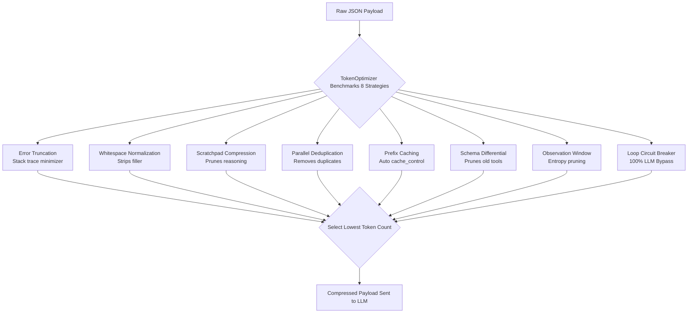
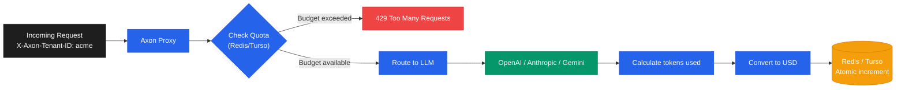

# Core Concepts & Intelligence Architecture

Axon Bridge is more than a string compressor. It is a full intelligence layer that sits between your application and any LLM provider, actively manipulating payloads to protect your budget, reduce latency, and prevent errors — all transparently.

---

## 1. Dynamic Encoding & Structural Compression (Always-On)

JSON is notoriously token-heavy: punctuation (`"`, `{`, `}`, `,`), repeated keys on every row, and whitespace all inflate the token count with zero semantic value.

Instead of relying on a single compression format, Axon's `TokenOptimizer` benchmarks every inbound payload against **8 different encoding strategies simultaneously** and selects the one with the lowest token count. This is the **default, always-safe** compression layer — it only strips formatting syntax, never semantic data values.


```mermaid
graph TD
    Input[Raw JSON Payload] --> Benchmark{TokenOptimizer Benchmarks 8 Strategies}

    Benchmark --> S1[Error Truncation<br/>Stack trace minimizer]
    Benchmark --> S2[Whitespace Normalization<br/>Strips filler]
    Benchmark --> S3[Scratchpad Compression<br/>Prunes reasoning]
    Benchmark --> S4[Parallel Deduplication<br/>Removes duplicates]
    Benchmark --> S5[Prefix Caching<br/>Auto cache_control]
    Benchmark --> S6[Schema Differential<br/>Prunes old tools]
    Benchmark --> S7[Observation Window<br/>Entropy pruning]
    Benchmark --> S8[Loop Circuit Breaker<br/>100% LLM Bypass]

    S1 --> Pick{Select Lowest Token Count}
    S2 --> Pick
    S3 --> Pick
    S4 --> Pick
    S5 --> Pick
    S6 --> Pick
    S7 --> Pick
    S8 --> Pick

    Pick --> Output[Compressed Payload Sent to LLM]
```

**Verified Results (live testing):**

| Payload | Strategy | Result |
|---|---|---|
| Python Stack Trace (Error Log) | Error Truncation | **99.6% savings** (4,240→19 tokens) |
| Infinite Tool Calling Loop | Loop Circuit Breaker | **100% LLM Bypass** ($0 cost) |
| Kubernetes YAML | Whitespace/Syntax Normalization | **15.9% savings** |
| AWS EC2 JSON Response | Structural Compression | **14.3% savings** |
| Verbose JSON Schema Tools | Tool Schema Optimization | **25.3% savings** (455→340 tokens) |

> Compression is purely structural. It strips JSON syntax and flattens nesting. **Zero semantic data is ever removed.**

---

## 2. The Stateful Threads API (Network Savings)

Standard LLM APIs (OpenAI, Gemini, Anthropic) are **stateless** — every request must upload the entire `messages=[...]` array from scratch. In long conversations, this wastes massive client-side bandwidth uploading history the model has already processed.

Axon's **Stateful Threads API** solves this. By sending the header `X-Axon-Stateful-Thread: true`, your client only uploads the new message delta.

**How it works:**
1. Your app sends only the *new* message (tiny delta) to Axon.
2. Axon rehydrates the full conversation history from local Turso/libSQL or Redis.
3. Axon applies structural compression to the full history.
4. The compressed full context is forwarded to the stateless LLM.

**Result:** Client transmits ~1 message over the network. LLM receives a fully rehydrated, compressed context — combining up to 99% client bandwidth savings (grows with conversation length) with up to 99.6% API token savings on agentic payloads.

---

## 3. Native Provider Prompt Caching & Stateful Compression

> [!WARNING]
> **Never enable TRON/TOON against stateless APIs (like standard OpenAI or Ollama).**
> These algorithms physically delete data and replace it with `@ref` pointers. Stateless models have no memory of previous turns, so they will hallucinate when receiving `@ref` pointers.

To achieve **maximum API token savings**, use **Native Provider Caching** where the provider's server caches KV states:

- **TOON (Token-Oriented Object Notation / "Deltas")**: Tracks message position state across turns. On subsequent turns, replaces unchanged messages with `{"__deleted__": true}` markers.
- **TRON (Token-Reduced Object Notation / "References")**: Replaces long repeated scalar strings with compact integer IDs (`@ref:1`, `@ref:2`).

| Provider | Mechanism | Savings | How to enable |
|---|---|---|---|
| **Anthropic** | `cache_control: ephemeral` on largest message + system prompt | ~80% cost on repeated context | Automatic for `claude-3*` models |
| **Gemini** | `cachedContent` API via LiteLLM adapter | ~80% cost on repeated context | `AXON_ENABLE_GEMINI_PROMPT_CACHE=true` + paid plan |

> [!IMPORTANT]
> Gemini Context Caching requires a **paid Gemini API plan**. Free-tier keys will receive `429` errors.

---

## 4. Agentic Protections

Axon natively includes protections designed specifically for autonomous agent workflows:

1. **Vision Payload Downscaling** — Uses `Pillow` to silently downscale `base64` images to 768px before sending to vision APIs, reducing Vision token costs.
2. **Fast Vector Semantic Cache** — Thread-safe LRU cache with TTL. If a prompt is semantically similar (above threshold) to a previous request, Axon returns the cached response with zero API tokens used. **Live verified:** `x-axon-cache: HIT` on a paraphrased question.
3. **PII Redaction** — Heuristics auto-redact Credit Cards, SSNs, Emails, and Phone Numbers before the payload reaches any external endpoint. **Live verified:** SSN stripped from `"My SSN is 123-456-7890"`.
4. **ML Smart Router** — Local `sentence-transformers` classifies prompt intent and routes casual/simple queries to cheaper lite models. Enable with `AXON_ENABLE_SEMANTIC_ROUTING=true`.
5. **BM25 Semantic Graph Pruning** — Uses `rank_bm25` to score and drop the bottom 25% of irrelevant context symbols based on the current query, saving tokens per turn.
6. **Schema Flattening** — Converts deeply nested multi-dimensional JSON into flat dot-notation before compression, removing structural bloat from complex agentic payloads.
7. **JSON Healing** — If the LLM returns malformed JSON or fails schema validation, Axon intercepts, appends the error to the message history, and retries — up to 3 attempts. Validation uses **Pydantic V2 `TypeAdapter`** (no `jsonschema` dependency).
8. **Exact-Match KV Cache** — SHA-256 hash of repeated deterministic payloads returns the exact prior response instantly. **$0 API cost.** Live verified.
9. **Prompt Firewall** — Blocks 27 known prompt injection and jailbreak patterns. **Live verified:** Jailbreak attempt returned `SYSTEM HALTED.` before reaching LLM.
10. **Shannon Entropy Hallucination Guard** — Parses `logprobs` from OpenAI/Ollama streams and computes probability distribution entropy. Surgically blocks responses when LLM confidence is below threshold. Enable with `AXON_ENABLE_HALLUCINATION_GUARD=true`.
11. **In-Process Rate Limiter** — Native ASGI middleware using `cachetools.TTLCache`. Default: 200 requests/IP/60s. `/health` and `/metrics` are always exempt.

---

## 5. Real Dollar Cost Tracking & Tenant Quotas

Axon calculates the actual **USD cost saved** by compression per request and returns it in the `x-axon-cost-saved-usd` response header. For multi-tenant use cases, you can enforce hard spending limits:


```mermaid
graph LR
    Req["Incoming Request<br/>X-Axon-Tenant-ID: acme"]:::client --> Gateway["Axon Proxy"]:::axon
    Gateway --> Check{"Check Quota<br/>(Redis/Turso)"}:::axon
    Check -->|"Budget exceeded"| Rej["429 Too Many Requests"]:::error
    Check -->|"Budget available"| Route["Route to LLM"]:::axon

    Route --> LLM["OpenAI / Anthropic / Gemini"]:::llm
    LLM --> Calc["Calculate tokens used"]:::axon
    Calc --> Cost["Convert to USD"]:::axon
    Cost --> Store[("Redis / Turso<br/>Atomic increment")]:::db

    classDef client fill:#1e1e1e,stroke:#333,color:#fff
    classDef axon fill:#2563eb,stroke:#1d4ed8,color:#fff
    classDef error fill:#ef4444,stroke:#b91c1c,color:#fff
    classDef llm fill:#059669,stroke:#047857,color:#fff
    classDef db fill:#f59e0b,stroke:#d97706,color:#fff
```

Pass `X-Axon-Tenant-ID: <tenant>` in every request to track spend. Use the admin API to set limits:

```bash
# Set a $5.00 quota for tenant "acme-corp"
curl -X POST http://localhost:8080/admin/quotas/acme-corp \
  -H "Authorization: Bearer $AXON_ADMIN_API_KEY" \
  -H "Content-Type: application/json" \
  -d '{"quota_usd": 5.00}'
```

---

## 6. Settings Architecture

Axon's configuration is powered by **Pydantic V2 `BaseSettings`** from `pydantic-settings`. Every setting maps directly to an environment variable with the `AXON_` prefix.

**Key behaviours:**
- **Strict type validation** — Setting `AXON_PORT=invalid` raises a `ValidationError` at startup. You learn about configuration errors immediately.
- **Comma-list parsing** — Fields like `AXON_ENABLED_FORMATS` and `AXON_ALLOWED_DOMAINS` are declared as `str | list[str]` with a `@field_validator` that auto-splits on commas.
- **env_parse_fallback** — If a value can't be parsed as the strict type, Pydantic tries a fallback parse before failing.
- **Production enforcement** — When `AXON_ENV=production`, startup fails if `AXON_ADMIN_API_KEY` is not set.

```env
# Example .env
AXON_ENV=development
AXON_HOST=127.0.0.1
AXON_PORT=8080
AXON_LOG_FORMAT=text
AXON_LOG_LEVEL=INFO
AXON_MEMORY_TYPE=turso
AXON_TURSO_URL=file:./axon_sessions.db

# Compression (all true by default — listed here for explicitness)
AXON_ENABLE_EXACT_MATCH_CACHE=true
AXON_ENABLE_SEMANTIC_CACHE=true
AXON_ENABLE_AGENTIC_OPTIMIZATIONS=true

# Opt-in features
AXON_ENABLE_PROMPT_FIREWALL=false
AXON_ENABLE_PII_REDACTION=false
AXON_ENABLE_SEMANTIC_ROUTING=false
```

---

## 7. Token Counting & Provider SDKs

Axon uses a **tokenizer factory** that automatically picks the right backend per provider:

| Provider / Model Family | Tokenizer Backend |
|---|---|
| OpenAI (GPT-4, GPT-3.5), most LiteLLM | `tiktoken` — `cl100k_base` (default) |
| Gemini | `google-genai` SDK client (`from google import genai`) |

> [!NOTE]
> The `google-genai` SDK is the **current, officially supported** Gemini Python SDK. The older `google.generativeai` import path is deprecated. Install with `pip install axon-bridge[gemini]`.

The `AXON_TOKENIZER_MODEL` setting controls the tiktoken model. For Gemini, token counting uses the official client API — no tiktoken approximation.
