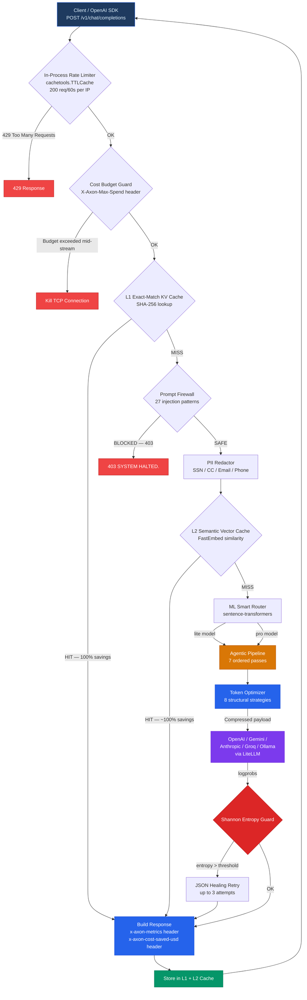
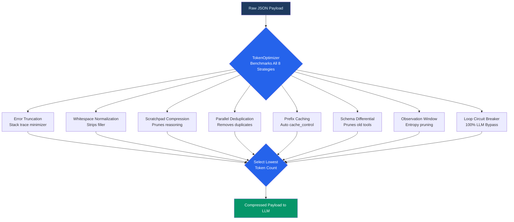
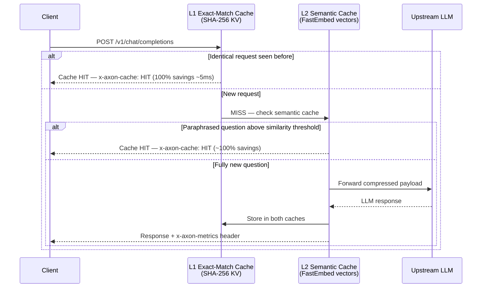
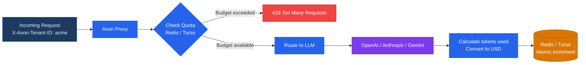
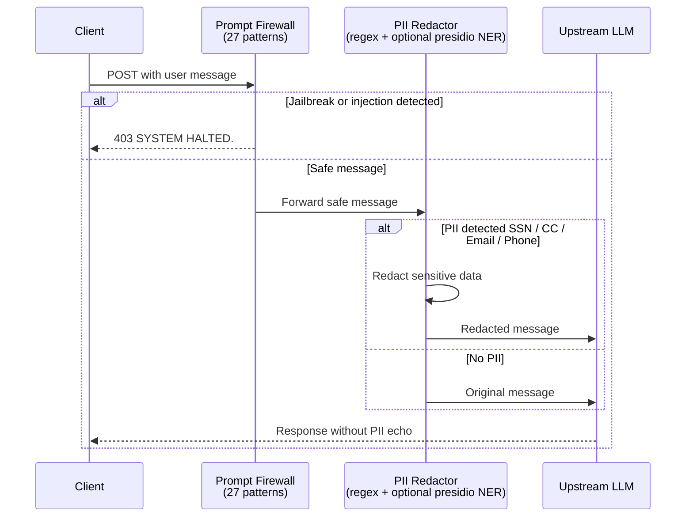
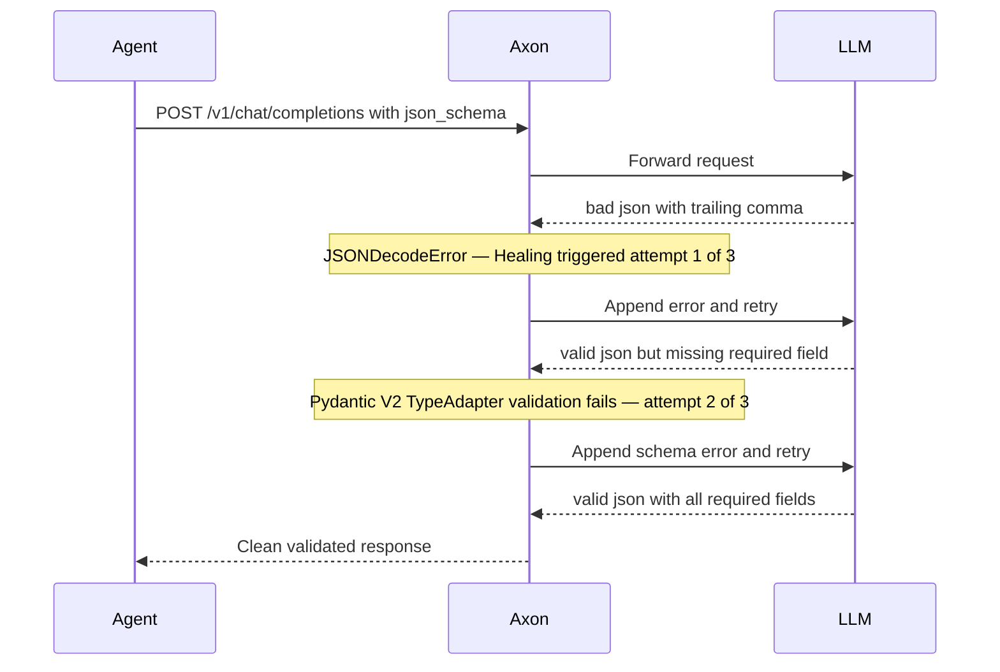
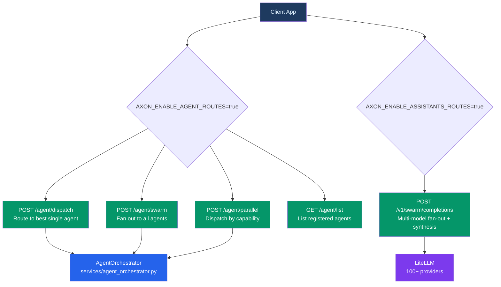
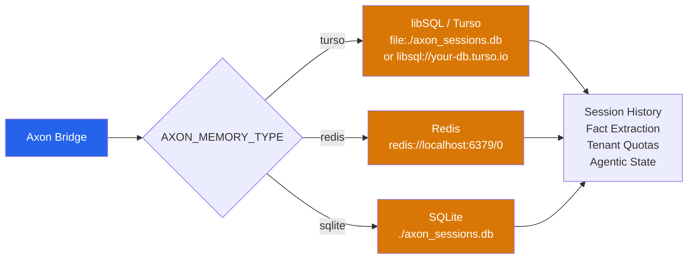

# Architecture Reference

This document provides comprehensive system architecture diagrams for Axon Bridge. All diagrams reflect the actual code structure as of version `0.3.0`.

---

## 1. Full Request Pipeline

Every incoming request flows through the following stages before reaching the upstream LLM:

---

## 2. Agentic Optimization Pipeline

The 7-pass pipeline runs automatically when `X-Axon-Session-ID` is present. Stateless passes always run; session-aware passes activate when a session ID is provided.

```mermaid
flowchart LR
    IN["Incoming\nmessages + tools"]:::input

    IN --> P1["Pass 1\nError Truncation\nStateless ~0ms"]:::stateless
    P1 --> P2["Pass 2\nWhitespace Normalization\nStateless ~0ms"]:::stateless
    P2 --> P3["Pass 3\nScratchpad Compression\nStateless ~1ms"]:::stateless
    P3 --> P4["Pass 4\nParallel Deduplication\nStateless ~1ms"]:::stateless

    P4 --> HasSession{"Session ID\npresent?"}

    HasSession -->|"No"| OUT
    HasSession -->|"Yes"| P5["Pass 5\nPrefix Caching\nSession-aware ~0ms"]:::session
    P5 --> P6["Pass 6\nTool Schema Differential\nSession-aware ~1ms"]:::session
    P6 --> P7["Pass 7\nObservation Window Pruning\nShannon entropy x recency\nSession-aware ~2ms"]:::session
    P7 --> OUT

    OUT["Optimized\nmessages + tools"]:::output

    classDef input fill:#1e3a5f,color:#e0f2fe
    classDef stateless fill:#2563eb,color:#fff
    classDef session fill:#d97706,color:#fff
    classDef output fill:#059669,color:#fff
```

> **Loop Circuit Breaker** is a separate mechanism (`check_loop` / `record_tool_call`) that runs *before* the pipeline and short-circuits identical repeated tool calls with **100% LLM bypass**.

### Pipeline Savings at a Glance

| Pass | Module | Scope | Typical Savings |
|---|---|---|---|
| 1 | `error_truncator` | Stack trace → single line | **~90%** on tool failures |
| 2 | `whitespace_normalizer` | Unicode + whitespace cleanup | **5–15%** |
| 3 | `scratchpad_compressor` | `<thinking>` / ReAct dedup | **30–50%** on reasoning |
| 4 | `parallel_deduplicator` | Cross-tool field dedup | **15–40%** |
| 5 | `prefix_cacher` | Provider KV cache markers | **85–90%** on fixed prefixes |
| 6 | `tool_schema_diff` | Skip unused tool schemas | **80%** on schemas |
| 7 | `observation_window` | Entropy-based history prune | **40–70%** on history |
| ± | Loop Circuit Breaker *(separate)* | Detect identical tool calls | **100%** — bypasses LLM |

---

## 3. Token Compression Strategies

The `TokenOptimizer` benchmarks every payload against all 8 strategies and picks the winner with the lowest token count.

**Verified benchmark results:**

| Payload | Strategy | Token Savings |
|---|---|---|
| Python Stack Trace (Error Log) | Error Truncation | **99.6%** (4,240→19 tokens) |
| Infinite Tool Calling Loop | Loop Circuit Breaker | **100% LLM Bypass** ($0 cost) |
| Kubernetes YAML | Whitespace/Syntax Normalization | **15.9%** |
| AWS EC2 JSON Response | Structural Compression | **14.3%** |
| Verbose JSON Schema Tools | Tool Schema Optimization | **25.3%** (455→340 tokens) |

---

## 4. Caching Layers (L1 + L2)

---

## 5. Multi-Tenant Cost Tracking

---

## 6. Security: Firewall & PII Flow

---

## 7. JSON Healing Loop

When `response_format.json_schema` is requested and the LLM returns malformed JSON:

---

## 8. Agent Orchestration Routes

---

## 9. Memory & Persistence Backends

> [!WARNING]
> In serverless environments (AWS Fargate, Google Cloud Run) or multi-instance deployments, local file storage (`turso` with `file:./` or `sqlite`) **will not work** — sessions are lost on restart. Use `redis` or remote Turso (`libsql://`) instead.

---

## 10. Tech Stack Summary

| Component | Technology | Notes |
|---|---|---|
| **Web framework** | FastAPI + Starlette | ASGI, full async |
| **ASGI server** | Granian (Rust) | High-throughput — replaces uvicorn |
| **LLM routing** | LiteLLM | 100+ provider support |
| **Settings** | Pydantic V2 `BaseSettings` | `pydantic-settings`; strict type validation at startup |
| **Rate limiter** | `cachetools.TTLCache` ASGI middleware | 200 req/60s per IP; no external dependency |
| **Schema validation** | Pydantic V2 `TypeAdapter` + `create_model` | No `jsonschema` dependency |
| **Token counting** | `tiktoken` (OpenAI) / `google-genai` (Gemini) | Provider-aware factory |
| **Compression** | `gcf-python` (GCF graph/generic formats) | 8 strategies benchmarked per request |
| **Vector cache** | `fastembed` | Local embedding model; no external API |
| **Tracing** | OpenTelemetry SDK + OTLP exporter | `AXON_OTLP_ENDPOINT` to enable |
| **Metrics** | Prometheus via `opentelemetry-exporter-prometheus` | `/metrics` endpoint |
| **Storage** | libSQL (Turso) / SQLite / Redis | Configurable via `AXON_MEMORY_TYPE` |
| **Image handling** | Pillow | Vision downscaling to 768px max |
| **JSON serialization** | `orjson` | Fast binary JSON; used throughout |
